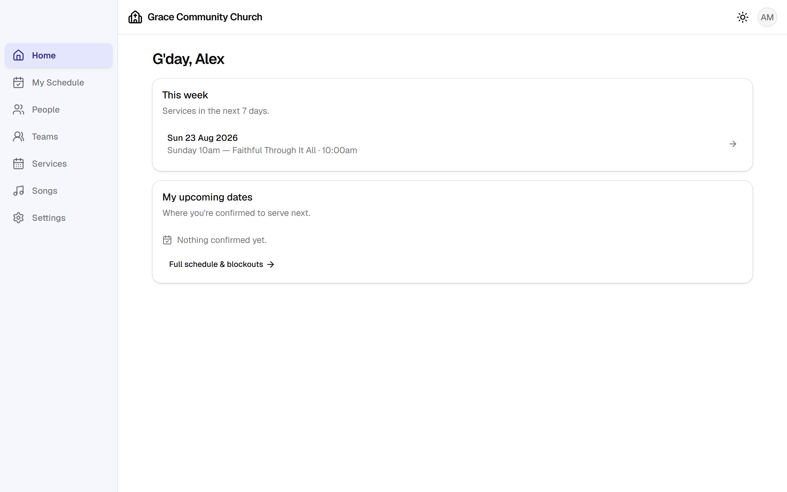
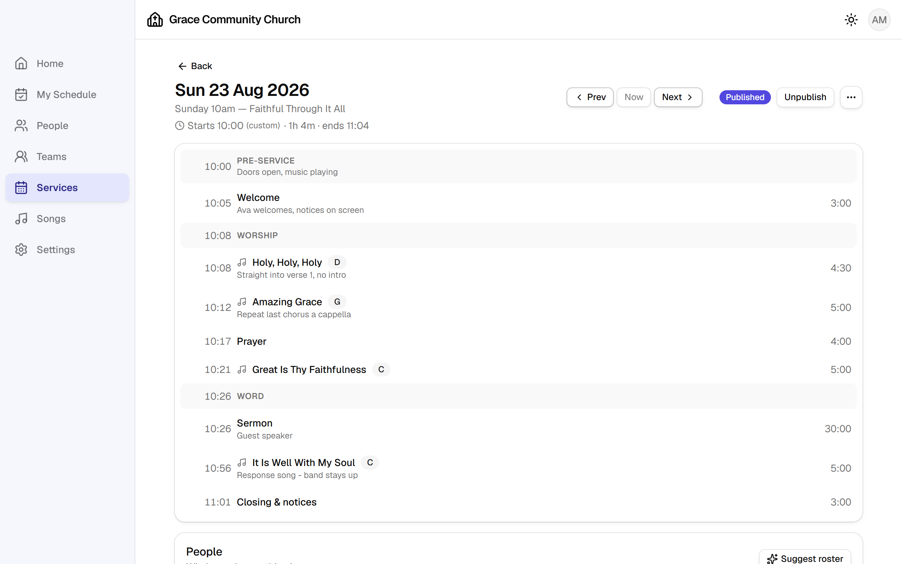
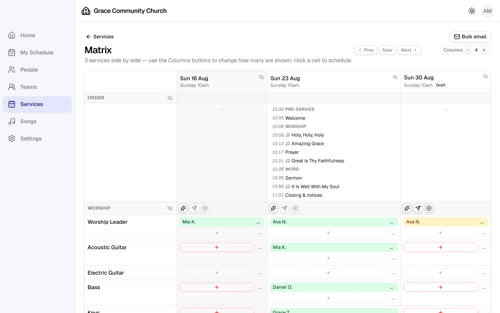
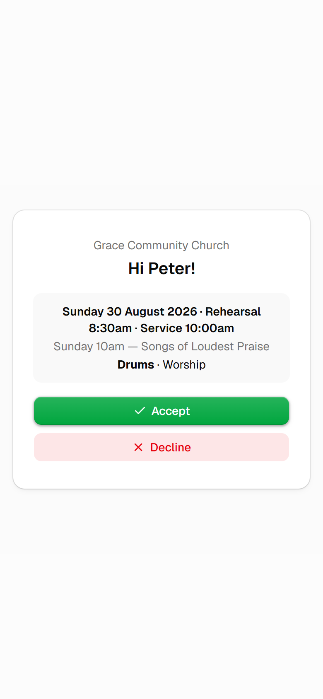

# LSCroster

**Open-source worship & service planning for churches** — a self-hosted
alternative to Planning Center **Services**, with a built-in people directory.

Plan your order of service, roster your teams, let people accept or decline from
their phone without logging in, and stop chasing replies in a group chat.

[](https://github.com/mvmran/lscroster/actions/workflows/ci.yml)
[](LICENSE)

Each church runs its **own independent instance**: one repository fork, one
[Supabase](https://supabase.com) project, one [Vercel](https://vercel.com)
deployment. No multi-tenancy, no SaaS, no per-seat pricing — your data sits in
your own database, comfortably inside the free tiers for a typical congregation
(~50 users, roughly $0/month).

**→ [Set up your own instance](docs/SETUP.md)** (about 45 minutes, no coding)

[](https://vercel.com/new/clone?repository-url=https%3A%2F%2Fgithub.com%2Fmvmran%2Flscroster&env=VITE_SUPABASE_URL,VITE_SUPABASE_ANON_KEY&envDescription=Your%20Supabase%20project%20URL%20and%20anon%20key&envLink=https%3A%2F%2Fgithub.com%2Fmvmran%2Flscroster%2Fblob%2Fmain%2Fdocs%2FSETUP.md&project-name=lscroster&repository-name=lscroster)

The button handles the hosting half. Create your Supabase project and run the
migrations first — [SETUP.md](docs/SETUP.md) walks through both halves in order.

---

## What it does

**Services**
- Service types (e.g. "Sunday 10am") and dated plans, with recurring plan
  generation — create the next eight Sundays in one go
- Drag-and-drop order of service: headers, songs and items with durations and a
  running clock
- Multiple times per plan (rehearsal + service), shown in emails and My Schedule
- Print-ready run sheet and PDF export; lyrics sheets for the band
- Plan attachments and notes; draft vs published, so nobody sees a half-built plan

**Songs**
- Song library with authors, CCLI numbers, copyright, tags and usage reports
  (frequency, last played, by service type)
- Arrangements per song — key, BPM, meter, reference recording, versioned lyrics
- Medleys: one arrangement spanning several songs, counted for every song it
  contains

**Scheduling**
- Teams, positions, and per-person qualifications with trainee/qualified levels
- Matrix view: weeks × positions across upcoming plans, rostered inline
- Auto-scheduling suggestions that respect qualifications, blockouts, fairness
  and how recently someone served
- Scheduling rules — pairings, exclusions, per-plan minimums, and conditional
  rules ("if a woman leads worship, roster two female vocalists")
- Blockouts: people mark themselves unavailable; the roster respects it
- **Answer without logging in** — the emailed link is the credential, so replies
  actually come back

**Email**
- Scheduling requests, nudges for silence, reminders before the service, a
  publish notification and a weekly roster-status digest for leaders
- A worship set-list email at publish time, laid out like the Word document your
  team already uses
- Every send logged, with the delivery result, in Settings → Email delivery

**People & admin**
- People directory that works with or without logins — half a church roll has no
  intention of ever signing in, and that is fine
- Invite-only accounts, roles (admin / leader / member), per-team leaders and
  read-only viewers
- Managed accounts for people who need someone answering on their behalf
- Contact-detail visibility rules, an audit log of who changed what, and a
  read-only Projection API for your projection software
  ([PROJECTION-API.md](docs/PROJECTION-API.md))

Mobile-first throughout, installable to a phone's home screen, with a dark mode
and an accent colour you pick in Settings.

---

## How it compares to Planning Center

LSCroster deliberately mirrors **Services** and a light slice of **People**. It
is not a Planning Center clone.

| | LSCroster | Planning Center |
| --- | --- | --- |
| Service plans, order of service, songs | ✅ | ✅ |
| Team scheduling, blockouts, email requests | ✅ | ✅ |
| People directory | ✅ lightweight | ✅ full CRM |
| Auto-scheduling with fairness + rules | ✅ | partial |
| Projection API for your own software | ✅ | via integrations |
| Check-ins, Giving, Groups, Registrations | ❌ | ✅ |
| Native mobile apps | ❌ (installable web app) | ✅ |
| SMS notifications, CCLI reporting integration | ❌ | ✅ |
| Your data in your own database | ✅ | ❌ |
| Cost at ~50 users | ~$0/month | paid tiers |

If you need Check-ins or Giving, use Planning Center — it is a good product. If
you want your rosters and plans to be yours, run this.

---

## Screenshots

| | |
| --- | --- |
|  |  |
| **Home** — this week's service and your upcoming dates | **A plan** — order of service with a running clock, rosters below |
|  |  |
| **Matrix** — weeks across, positions down, rostered inline | **A scheduling request** — answered from the emailed link, no login |

---

## Stack

Vite + React + TypeScript · Tailwind CSS + shadcn/ui · TanStack Query ·
React Router · Supabase (Postgres, Auth, Storage, Edge Functions, pg_cron) ·
Resend · Vercel

Everything runs on managed free tiers; there is no server to patch.

---

## Local development

Requires Node 20+ and Docker Desktop.

```bash
npm install
npx supabase start
cp .env.example .env.local   # fill in the URL + anon key printed by supabase start
npm run dev
```

A fresh local database is empty, so the app opens its one-time setup wizard —
the same first-run experience a new church gets. `npm run db:demo` loads a demo
church to click around in.

| Command | Purpose |
| --- | --- |
| `npm run dev` | local dev server |
| `npm run build` | production build |
| `npm run lint` / `npm run typecheck` / `npm test` | checks CI also runs |
| `npm run db:demo` / `npm run db:demo:wipe` | load / remove the demo data |
| `npx supabase db reset --local` | rebuild the local DB from migrations |
| `npx supabase db push` | apply migrations to your linked project |
| `npx supabase functions deploy` | deploy the Edge Functions |

Schema changes are always a new migration file — never a dashboard edit — which
is what makes upgrades safe for every church running a copy.

---

## Documentation

| Guide | |
| --- | --- |
| [SETUP.md](docs/SETUP.md) | stand up your own instance, start to finish |
| [UPGRADE.md](docs/UPGRADE.md) | pull a new release into your fork |
| [BACKUPS.md](docs/BACKUPS.md) | backing up and restoring your data |
| [PROJECTION-API.md](docs/PROJECTION-API.md) | read-only API for projection software |
| [PHASES.md](PHASES.md) | build history, release notes and design decisions |

---

## Contributing

Issues and pull requests are welcome at
[github.com/mvmran/lscroster](https://github.com/mvmran/lscroster). If you are
running your own instance and hit a rough edge in the setup docs, that is worth
an issue too — the docs are meant to work without a conversation.

## Licence

[GPLv3](LICENSE). Run it, modify it, deploy it for your church; if you distribute
a modified version, share those changes under the same licence.
