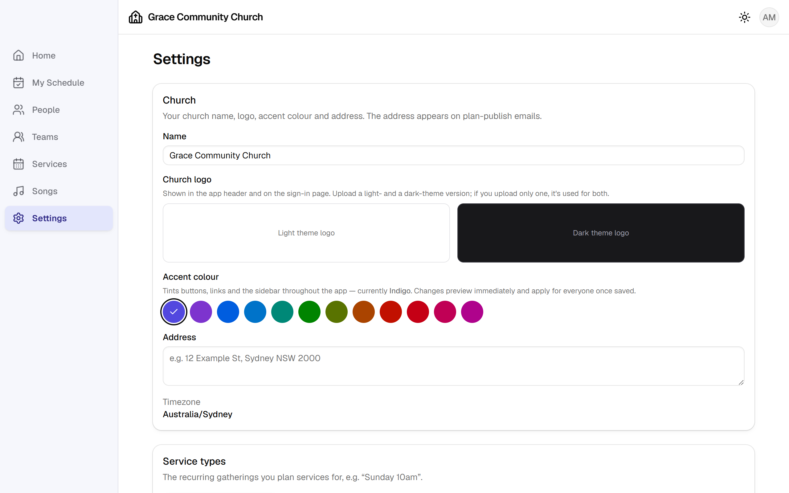

# Setting up your own LSCroster instance

LSCroster is **single-tenant**: your church runs its own copy — one repository,
one Supabase project, one Vercel deployment. Nobody else's data touches yours,
and a typical congregation fits inside the free tiers of all three services.

This guide takes about **45 minutes**, most of it waiting for accounts to be
created. You need to be comfortable copying commands into a terminal; you do not
need to know how to write code, and you will not edit a single source file.

(We time this. The last run, with the four accounts already in place, took 36
minutes end to end and changed no code — so budget the difference for signing
up.)

**What you will end up with**

- your roster app at a URL you choose (e.g. `https://roster.yourchurch.org`)
- an admin login for yourself, from which you invite everyone else
- scheduling request, reminder and roster-digest emails sending from your own
  domain
- a database only you can see, and a backup routine you control
  ([BACKUPS.md](BACKUPS.md))

---

## Before you start

| You need | Why | Cost |
| --- | --- | --- |
| A [GitHub](https://github.com) account | holds your copy of the code | free |
| A [Supabase](https://supabase.com) account | database, logins, files, email jobs | free tier |
| A [Vercel](https://vercel.com) account | hosts the app itself | free (Hobby) |
| A [Resend](https://resend.com) account | sends the emails | free (3,000/month) |
| [Node.js](https://nodejs.org) 20 or newer | runs the setup commands | free |
| A domain name (optional) | nicer URL and better email delivery | ~$15/year |

Everything below assumes a terminal opened in the folder where you cloned the
project. On Windows, use PowerShell or Git Bash.

---

## Step 1 — Get your own copy of the code

Fork the repository on GitHub (**Fork** button on
[mvmran/lscroster](https://github.com/mvmran/lscroster)), then clone your fork
and install the tooling:

```bash
git clone https://github.com/<your-github-username>/lscroster.git
cd lscroster
npm install
```

Forking (rather than downloading a zip) is what makes upgrades easy later — see
[UPGRADE.md](UPGRADE.md).

Two things that look alarming and are not. `npm install` ends with a summary
like `13 vulnerabilities (7 high)` — that is npm reporting published advisories
across the whole dependency tree, not a problem with your copy; fixes arrive
with each release, which is the other reason to follow [UPGRADE.md](UPGRADE.md).
And nothing in this guide needs Docker: it is only for running the app on your
own machine (see [Running it locally](#running-it-locally-optional) at the end).

---

## Step 2 — Create your Supabase project

1. Sign in to Supabase and click **New project**.
2. Name it something like `lscroster`.
3. **Region: choose the one closest to your church.** This is the single biggest
   factor in how fast the app feels, and it cannot be changed later.
4. Set a database password and save it in your password manager — you will need
   it in the next step and for backups.

When the project finishes provisioning, open **Project Settings → General** and
copy the **Project ID** (also called the project ref) — a 20-character string
like `abcdefghijklmnopqrst`.

---

## Step 3 — Create the database

This applies every migration in `supabase/migrations/`, which builds every
table, every row-level-security policy, the three private storage buckets and
the hourly job that sends reminders. It is the only step that touches the
schema — you never create tables by hand.

```bash
npx supabase login
```

```bash
npx supabase link --project-ref <your-project-ref>
```

```bash
npx supabase db push
```

`db push` asks for the database password from Step 2 and prints each migration
as it applies. Expect the last line to be `Finished supabase db push.`

---

## Step 4 — Deploy the Edge Functions

Everything that must not run in a browser — sending email, issuing invitations,
handling "I can serve"/"I can't serve" replies, the nightly jobs — runs as a
Supabase Edge Function.

```bash
npx supabase functions deploy
```

That deploys all of them, using the JWT settings already recorded in
`supabase/config.toml` (three functions are intentionally public: the first-run
setup, the invitation-acceptance page and the emailed respond link, which
authenticates with its own single-use token).

---

## Step 5 — Put the app online with Vercel

1. Go to [vercel.com/new](https://vercel.com/new) and import your fork.
2. Vercel detects Vite automatically — leave the build settings alone.
3. Add two **Environment Variables** (Supabase Dashboard →
   **Project Settings → API keys** has both values):

   | Name | Value |
   | --- | --- |
   | `VITE_SUPABASE_URL` | `https://<your-project-ref>.supabase.co` |
   | `VITE_SUPABASE_ANON_KEY` | the **anon / publishable** key |

   A project created today lists that key as `sb_publishable_…`; older projects
   show a long `eyJ…` token labelled `anon`. Either works — do **not** use
   anything labelled `secret` or `service_role`.

   Both are safe to expose in a browser — row-level security, not secrecy, is
   what protects your data.
4. Click **Deploy** and note the URL Vercel gives you
   (`https://something.vercel.app`). If you have a domain, add it now under
   **Project → Settings → Domains** and set it as primary.

From here on, `APP_URL` means whichever of those URLs is your real one.

---

## Step 6 — Set the server-side secrets

These live in Supabase, never in the repository, and are read only by the Edge
Functions.

Get a Resend API key first: sign in to Resend → **API Keys** → **Create API
Key** (send-only permission is enough). Until you verify your own domain in
Step 9, use Resend's test sender `onboarding@resend.dev` — it can only deliver
to the address you signed up with, which is fine for testing.

Generate a long random string for `CRON_SECRET` (any password generator will
do), then:

```bash
npx supabase secrets set RESEND_API_KEY=re_xxx EMAIL_FROM=onboarding@resend.dev APP_URL=https://your-app.vercel.app CRON_SECRET=<long-random-string>
```

| Secret | What it does |
| --- | --- |
| `RESEND_API_KEY` | authenticates with Resend |
| `EMAIL_FROM` | the address your emails come from |
| `APP_URL` | how emails build their links — must have no trailing slash |
| `CRON_SECRET` | proves an incoming job request came from your own scheduler |

### Optional: drafting a song's meaning

Songs in a language other than English can carry three texts — the native
script, a singable transliteration, and the English meaning. The transliteration
is generated for you offline and costs nothing. The **meaning** is a translation,
which needs a language model, so it is opt-in and billed to you.

Skip this and everything else still works: the editor simply doesn't offer the
button, and anyone can type the meaning by hand as before.

To switch it on, get a key from
[Google AI Studio](https://aistudio.google.com/apikey) and set it:

```bash
npx supabase secrets set GEMINI_API_KEY=<your-key>
```

| Secret | What it does |
| --- | --- |
| `GEMINI_API_KEY` | authenticates with the Gemini API — its presence is what enables the feature |
| `GEMINI_MODEL` | optional; defaults to `gemini-3.5-flash-lite`, the cheapest model that does this well |

The key never reaches the browser: the app calls the `generate-meaning` Edge
Function, which holds the key and calls Google. Only admins and leaders may
use it — the same people who may edit lyrics.

A drafted meaning lands in the editor for review and is only stored when
someone presses **Save changes**, so nothing is written to your database
without a human reading it first. Expect to correct it: it is a first draft,
and a machine has no idea what your church means by half of these lines.

Two places use it: the **Meaning** pane's "draft it from the native text" link,
and **Import lyrics** — a paste that brings native script but no meaning has one
drafted as it is added, so the lyrics, native and meaning panes all arrive
filled. The import dialog says "meaning will be drafted" before you press
**Add to lyrics** whenever it is about to spend a call.

---

## Step 7 — Switch on the scheduled emails

The hourly job already exists in your database (Step 3 created it), but it stays
dormant until you tell it where to call and how to prove who it is. Both values
live in Supabase Vault, encrypted at rest.

Run these two commands, using **the same** `CRON_SECRET` value as Step 6:

```bash
npx supabase db query --linked "select vault.create_secret('https://<your-project-ref>.supabase.co/functions/v1/reminders', 'reminders_function_url')"
```

```bash
npx supabase db query --linked "select vault.create_secret('<long-random-string>', 'reminders_cron_secret')"
```

That switches on three things, each of which you can retime or turn off from
**Settings → Communications setup**: nudges for unanswered requests, reminders
before a service, and a weekly roster-status digest for leaders.

Check the job is registered:

```bash
npx supabase db query --linked "select jobname, schedule, active from cron.job"
```

You should see `lscroster-reminders` on `0 * * * *`, active. After the next
whole hour passes, this confirms it actually called the function and that your
two secrets match:

```bash
npx supabase db query --linked "select d.status, r.status_code, r.content from cron.job_run_details d left join net._http_response r on true order by d.start_time desc limit 1"
```

`succeeded` with a `200` is what you want. A `401` means `reminders_cron_secret`
and `CRON_SECRET` are not the same string. Outside a send hour the function
replies `{"ok":true,"skipped":"outside send hour"}` — that is a healthy answer,
not a failure.

---

## Step 8 — Lock down sign-ups and finish the auth settings

In the Supabase Dashboard:

1. **Authentication → Sign In / Providers → Email**: turn **off** "Allow new
   users to sign up". LSCroster is invite-only; the first-run wizard creates
   your admin account through a different, one-time-only path.
2. **Authentication → URL Configuration**: set **Site URL** to your `APP_URL`,
   and add it to **Redirect URLs** as well. Password-reset links depend on this.

This is the only step in the guide that needs the dashboard. To prove the first
toggle took effect, ask the API to create an account — it should refuse:

```bash
curl -s -X POST "https://<your-project-ref>.supabase.co/auth/v1/signup" -H "apikey: <your-publishable-key>" -H "Content-Type: application/json" -d "{\"email\":\"nobody@example.com\",\"password\":\"not-a-real-password\"}"
```

Expect `{"code":422,...,"error_code":"signup_disabled"}`. Anything else means
sign-ups are still open and anyone who finds your URL can create a login.

---

## Step 9 — Run the first-run wizard

Open your app's URL. Because the database has no church record yet, it shows the
setup wizard exactly once. Enter:

- your church's name
- your timezone (everything the app displays — service times, reminder hours —
  uses this)
- your own name, email and a password

Submit, and you are signed in as the first admin. The wizard is now closed
permanently: every other account arrives by invitation.

Go to **Settings → Church** and add your logo (light and dark versions) and your
accent colour. The whole interface re-tints instantly, and it applies to
everyone — no code change, no redeploy.



---

## Step 10 — Send email from your own domain

Resend's test sender only reaches your own address, so do this before inviting
anyone.

1. In Resend: **Domains → Add Domain**, enter your church's domain.
2. Resend shows a set of DNS records — typically an MX and TXT pair for the
   return path, plus a DKIM TXT record. Add them at whoever hosts your DNS
   (Cloudflare, GoDaddy, your registrar).
3. Wait for Resend to show **Verified** (usually minutes; DNS can take hours).
4. Add a DMARC record — a TXT record at `_dmarc.yourchurch.org` with the value
   `v=DMARC1; p=none;` — which meaningfully improves delivery to Gmail and
   Outlook.
5. Point the app at the new sender:

```bash
npx supabase secrets set EMAIL_FROM=roster@yourchurch.org APP_URL=https://roster.yourchurch.org
```

Secrets take effect on the next function call; no redeploy needed.

Send yourself a test: invite a second person (use another address you own) from
**People → Add person → Invite**, and check **Settings → Email delivery**, which
logs every send attempt with its result.

---

## Step 11 — Optional: load demo data to explore

If you want a populated app to click around before entering real people:

```bash
npx supabase db query --linked -f supabase/seeds/demo-data.sql
```

(Or paste [`supabase/seeds/demo-data.sql`](../supabase/seeds/demo-data.sql) into
the Supabase Dashboard's **SQL Editor** and press **Run**. Locally, it is
`npm run db:demo`.)

You get three teams with positions, fifteen people, a weekly service type, six
public-domain hymns and three plans — last Sunday, this Sunday fully rostered
with an order of service, and next Sunday as a draft with unanswered requests.

The demo people have no email addresses, so nothing can be sent to them by
accident.

Remove it all whenever you like — the wipe matches only demo rows and leaves
anything you added alone:

```bash
npx supabase db query --linked -f supabase/seeds/demo-wipe.sql
```

(`npm run db:demo:wipe` locally.) It matches only rows the demo seed created, so
the church, your admin account and anything you have entered yourself survive.

---

## Step 12 — Check everything works

Walk through this once; it exercises every moving part.

- [ ] Sign in as your admin account.
- [ ] **Settings → Church**: church name, logo and accent colour are yours.
- [ ] **People → Add person**, invite a real address, accept the invitation from
      that inbox, and sign in as them.
- [ ] **Teams**: create a team, add positions, add members and tick what each
      person can do.
- [ ] **Services**: create a service type, then a plan on a future date.
- [ ] Schedule someone on that plan and send the request; confirm the email
      arrives and that answering from the emailed link works **without logging
      in**.
- [ ] **Settings → Email delivery** lists both sends as delivered.
- [ ] Open the app on a phone — it is designed to be used one-handed on a Sunday
      morning, and can be installed to the home screen.

If an email does not arrive, **Settings → Email delivery** records the reason
Resend gave, which is nearly always an unverified sender or a typo in
`EMAIL_FROM`.

---

## Running it locally (optional)

Useful for trying an upgrade before it reaches your congregation. Requires
Docker Desktop.

```bash
npx supabase start
```

Copy `.env.example` to `.env.local`, fill in the URL and anon key that
`supabase start` prints, then:

```bash
npm run dev
```

The local database starts empty, so you get the first-run wizard, exactly like a
brand-new instance. `npm run db:demo` fills it with the demo church. Emails are
captured locally at http://127.0.0.1:54324 instead of being sent.

---

## Where things live afterwards

| Task | Where |
| --- | --- |
| Church name, logo, accent colour, address | Settings → Church |
| Who is an admin / leader | Settings → Users & roles |
| Reminder timing, digests, set-list email | Settings → Communications setup |
| Delivery problems | Settings → Email delivery |
| Who changed what | Settings → Audit log |
| Keys for the projection software | Settings → Projection API (see [PROJECTION-API.md](PROJECTION-API.md)) |
| Upgrading to a newer release | [UPGRADE.md](UPGRADE.md) |
| Backups and restores | [BACKUPS.md](BACKUPS.md) |

---

## Troubleshooting

**The app shows the setup wizard again after I completed it.**
The browser is pointed at a different Supabase project than the one you set up —
check `VITE_SUPABASE_URL` in Vercel.

**`db push` says the migration history does not match.**
You are pushing to a project that already has some of the schema. Run
`npx supabase migration list --linked` to see the difference; on a brand-new
project it should list every local migration as unapplied.

**Invitation emails never arrive.**
Check **Settings → Email delivery** first. An empty log means the function was
never reached (`APP_URL`/keys); a logged failure means Resend rejected it (usually
an unverified sender domain).

**Reminders never send.**
Confirm both Vault secrets exist and that `reminders_cron_secret` matches
`CRON_SECRET` exactly:

```bash
npx supabase db query --linked "select name from vault.secrets"
```

Then check the hours in **Settings → Communications setup** — a `0` there means
"off". An admin can also trigger any job immediately from that page with
**(send now)**, which is the quickest way to prove the whole path works.

**Something else.** Open an issue at
[github.com/mvmran/lscroster/issues](https://github.com/mvmran/lscroster/issues).
