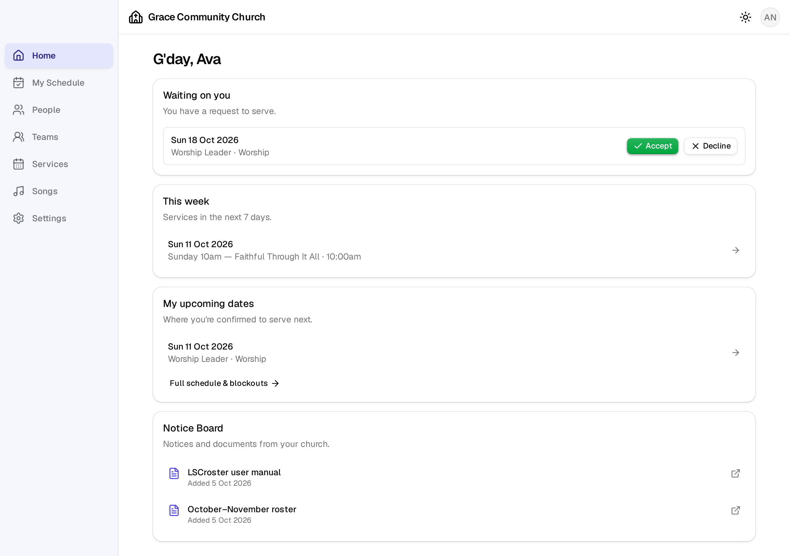
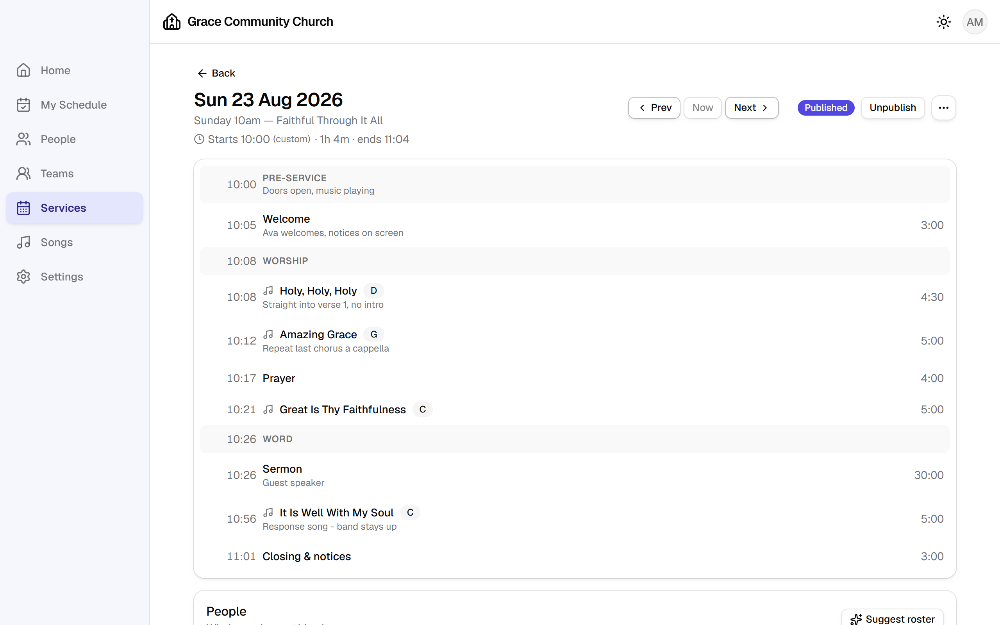
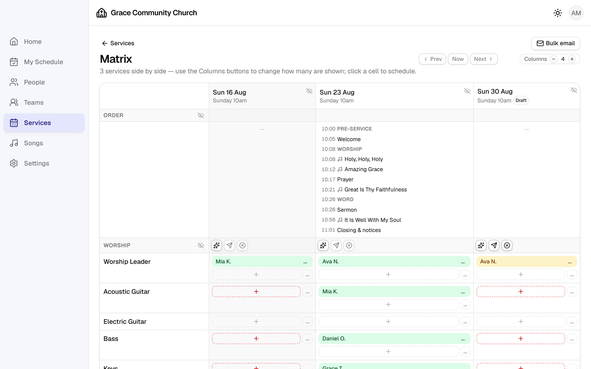
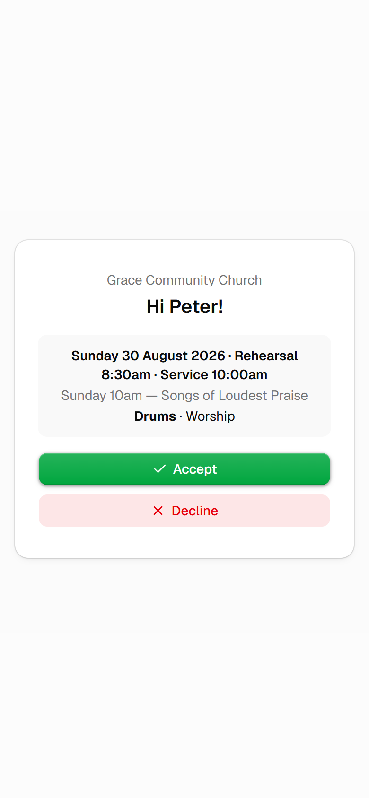
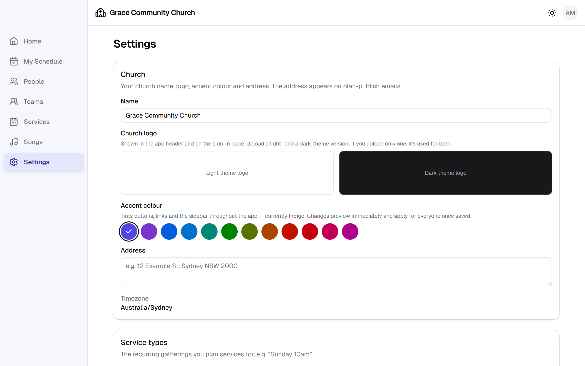

<!--
  LSCroster — User Manual
  -----------------------
  HOUSE CONVENTIONS for editing this file:

  • Screenshots — reference images RELATIVE TO THIS FILE. The five shared shots
    live in docs/screenshots/ (e.g. screenshots/plan.png); manual-only shots go
    in docs/screenshots/manual/. Caption with the <figure> form used below.
    Shoot from a demo-data instance in light mode (docs/screenshots/README.md)
    so no real person's details are ever published. Places that would benefit
    from a new shot are marked with a "Screenshot wanted" comment.

  • Callouts — blockquotes with a bold lead word: **Note**, **Tip**, **Warning**
    (Warning = can't be undone, or emails people).

  • Cross-references — "see §5.4", linked to the heading anchor. GitHub makes an
    anchor from each heading: lower-case, spaces→hyphens, punctuation dropped.
    Keep role tags OFF the heading line (put them on the line below) so the
    anchors stay short and the links in the contents keep working.

  • Roles — where a feature is limited, say so on the line under the heading,
    e.g. "**Who:** admins and coordinators". Roles are Member, Coordinator, Admin.

  The branded look (cover, header/footer bands, fonts) is applied when this file
  is rendered — see the AUTHORING NOTES at the bottom.
-->

# LSCroster

### User Manual &amp; Guide

Worship &amp; service planning for your church — plan services, schedule teams,
and respond to requests from your phone.

**Version 1.0.5**  ·  October 2026

_Your Church Name_

<!-- Replace with your church logo once you have one in the repo:
      -->

---

## About this manual

This manual is for everyone who uses LSCroster at your church: the members who
are rostered to serve, the coordinators who plan services and build rosters, and
the administrators who look after the whole system. It describes LSCroster
version 1.0.5. The app is updated from time to time, so a button or a label on
your screen may differ a little from what is written here.

LSCroster is open-source software, and every church runs its **own private
copy**. Some things this manual describes — which emails are sent and when, the
church name and colours, whether AI help is switched on, whether people and
songs can be deleted — are choices made by your church's administrator, so your
copy may behave slightly differently.

> **Note** — Screenshots in this manual were captured on a demonstration
> instance ("Grace Community Church") with sample data, so no real member's
> details appear. Your own screens will show your church's people, teams and
> plans.

## Licence and warranty disclaimer

**Copyright © 2026 Manoj Mathew.**

LSCroster and this manual are free software, distributed under the
**GNU General Public License, version 3** (GPLv3). You can redistribute them and/or
modify them under the terms of the GNU General Public License version 3 as published
by the Free Software Foundation.

In plain terms, the licence gives every church four freedoms, on a few
conditions:

- **Use it** — run LSCroster for any purpose, for as many people as you like,
  at no cost.
- **Study and change it** — the source code is published, and you may adapt it
  to your church's needs.
- **Share it** — you may give copies to others, free or for a fee.
- **Share your changes** — you may distribute your modified version too.

If you **distribute** LSCroster or a modified version of it, you must do so under
the same GPLv3 licence, keep the copyright and licence notices intact, make the
corresponding source code available to whoever receives it, and say that you
changed it. You may not add restrictions that take these freedoms away from the
people you give it to. These conditions are about passing copies on; using
LSCroster at your church is not restricted at all.

LSCroster is provided free of charge, and comes with **no warranty**. Sections 15
and 16 of the licence read:

> THERE IS NO WARRANTY FOR THE PROGRAM, TO THE EXTENT PERMITTED BY APPLICABLE
> LAW. EXCEPT WHEN OTHERWISE STATED IN WRITING THE COPYRIGHT HOLDERS AND/OR OTHER
> PARTIES PROVIDE THE PROGRAM "AS IS" WITHOUT WARRANTY OF ANY KIND, EITHER
> EXPRESSED OR IMPLIED, INCLUDING, BUT NOT LIMITED TO, THE IMPLIED WARRANTIES OF
> MERCHANTABILITY AND FITNESS FOR A PARTICULAR PURPOSE. THE ENTIRE RISK AS TO THE
> QUALITY AND PERFORMANCE OF THE PROGRAM IS WITH YOU. SHOULD THE PROGRAM PROVE
> DEFECTIVE, YOU ASSUME THE COST OF ALL NECESSARY SERVICING, REPAIR OR CORRECTION.
>
> IN NO EVENT UNLESS REQUIRED BY APPLICABLE LAW OR AGREED TO IN WRITING WILL ANY
> COPYRIGHT HOLDER, OR ANY OTHER PARTY WHO MODIFIES AND/OR CONVEYS THE PROGRAM AS
> PERMITTED ABOVE, BE LIABLE TO YOU FOR DAMAGES, INCLUDING ANY GENERAL, SPECIAL,
> INCIDENTAL OR CONSEQUENTIAL DAMAGES ARISING OUT OF THE USE OR INABILITY TO USE
> THE PROGRAM (INCLUDING BUT NOT LIMITED TO LOSS OF DATA OR DATA BEING RENDERED
> INACCURATE OR LOSSES SUSTAINED BY YOU OR THIRD PARTIES OR A FAILURE OF THE
> PROGRAM TO OPERATE WITH ANY OTHER PROGRAMS), EVEN IF SUCH HOLDER OR OTHER PARTY
> HAS BEEN ADVISED OF THE POSSIBILITY OF SUCH DAMAGES.

Your church is responsible for its own copy of LSCroster and the data in it —
including keeping backups (§14.3). This summary is for convenience only; the full
licence text in the `LICENSE` file of the LSCroster repository, also published at
<https://www.gnu.org/licenses/gpl-3.0.html>, is what governs.

---

## How this manual is organised

Read chapters 3 and 4 first: chapter 3 gets you signed in, and chapter 4 maps
the screens. If you are a member who mainly answers requests to serve, chapter 9
and the walkthrough in §12.4 are most of what you need. Chapter 12 is
step-by-step walkthroughs for the jobs people do week to week. The rest of the
manual is reference, arranged by feature. Your role — member, coordinator or
admin — decides which parts apply to you; anything limited to certain people
says who, directly under its heading.

## If you want… go to

| If you want to… | Go to |
| --- | --- |
| Sign in for the first time | [Chapter 3](#3-getting-started) |
| Reset a forgotten password | [§3.2](#32-signing-in-and-setting-your-password) |
| Install LSCroster on my phone | [§3.3](#33-installing-lscroster-on-your-phone) |
| See this week's plan | [§4.2](#42-the-home-dashboard) |
| Respond to a scheduling request | [Chapter 9](#9-responding-to-requests) |
| Change my answer after accepting | [§9.3](#93-accepting-declining-and-changing-your-answer) |
| Set the dates I'm unavailable | [§9.4](#94-blockouts-and-email-preferences) |
| Stop getting a particular email | [§10.5](#105-your-email-preferences) |
| Plan this Sunday's service | [§12.2](#122-plan-this-sundays-service) |
| Schedule a team and send requests | [§12.3](#123-schedule-a-team-and-send-out-requests) |
| Add a song with lyrics | [§12.5](#125-add-a-new-song-with-lyrics) |
| Roster a whole month quickly | [§12.6](#126-roster-a-month-in-the-matrix) |
| Publish a plan and send the set list | [§12.7](#127-publish-a-plan-and-email-the-set-list) |
| Find a replacement for someone who declined | [§12.11](#1211-find-a-replacement-when-someone-declines) |
| Invite a new person | [§12.9](#129-invite-a-new-member) |
| Give someone a job without making them a coordinator | [§12.10](#1210-grant-someone-a-permission-or-team-access) |
| Put a document on everyone's Home screen | [§12.12](#1212-put-a-document-on-the-notice-board) |
| Print a run sheet or lyrics sheet | [§11.4](#114-printing-and-pdf-run-sheets) |
| A word I don't recognise | [Glossary](#a-glossary) |
| Something isn't working | [Troubleshooting](#c-troubleshooting--faq) |

---

## Contents

**Front matter**
- [About this manual](#about-this-manual)
- [Licence and warranty disclaimer](#licence-and-warranty-disclaimer)
- [How this manual is organised](#how-this-manual-is-organised)
- [If you want… go to](#if-you-want-go-to)

**Chapters**
1. [Introduction &amp; Overview](#1-introduction--overview)
2. [Key Concepts](#2-key-concepts)
3. [Getting Started](#3-getting-started)
4. [Navigation &amp; Interface](#4-navigation--interface)
5. [People](#5-people)
6. [Services &amp; Plans](#6-services--plans)
7. [Songs &amp; Lyrics](#7-songs--lyrics)
8. [Scheduling &amp; Rostering](#8-scheduling--rostering)
9. [Responding to Requests](#9-responding-to-requests)
10. [Emails &amp; Notifications](#10-emails--notifications)
11. [Reports &amp; Records](#11-reports--records)
12. [Common Tasks (step-by-step)](#12-common-tasks-step-by-step)
13. [Tips &amp; Good Practice](#13-tips--good-practice)
14. [Administration &amp; How It Works](#14-administration--how-it-works)
15. [Appendix](#15-appendix)
    - [A. Glossary](#a-glossary)
    - [B. Roles &amp; permissions reference](#b-roles--permissions-reference)
    - [C. Troubleshooting &amp; FAQ](#c-troubleshooting--faq)
    - [D. Quick reference](#d-quick-reference)
    - [E. Document control](#e-document-control)
    - [F. Updating this manual](#f-updating-this-manual)

---

# 1. Introduction &amp; Overview

## 1.1 What LSCroster is

LSCroster is a web app for planning church services and rostering the people who
serve in them. Coordinators build each service's **order of service** — the
songs, items and headings in running order, with a clock that works out when
each one starts — and schedule people from each team into positions such as
Worship Leader, Bass or Sound. LSCroster then emails each person a **request to
serve**, which they accept or decline with one tap from their phone, without
needing to sign in.

It replaces the spreadsheet, the shared document and the group chat that many
churches use for rostering. Everyone sees the same up-to-date plan, people mark
the dates they're away so they aren't scheduled, replies come back in one place,
and reminders go out automatically.

## 1.2 Who it's for

| Role | What they mostly do |
| --- | --- |
| **Member** | Answers requests to serve, checks when they're on next, keeps their own contact details and away dates up to date, and reads the plan and lyrics for services they're on. |
| **Coordinator** | Plans services, looks after the song library, manages teams and positions, rosters any team, and gives other people access to specific jobs. |
| **Admin** | Everything a coordinator does, plus adding and inviting people, changing roles, and the church-wide settings (name, logo, emails, deletion safety). |

A member can also be given specific jobs — for example managing the song
library, or rostering one team — without becoming a coordinator. See
[§5.5](#55-roles-permissions-and-team-access) and the full reference in
[Appendix B](#b-roles--permissions-reference).

## 1.3 How your church runs it

Each church runs its own copy of LSCroster, with its own database. Your church's
people, plans and songs are not shared with any other church, and nobody outside
your church can see them. Your administrator sets the church-wide options —
name, logo, accent colour, time zone and which emails go out — and decides who
has which role.

## 1.4 A few words used throughout

| Word | Meaning |
| --- | --- |
| **Service type** | A regular gathering, e.g. "Sunday 10am". |
| **Plan** | One dated service of a service type, e.g. Sunday 7 September 10am, with its order of service and the people serving. |
| **Team** / **Position** | A group people serve in (Worship, Media) and a role within it (Acoustic Guitar, Sound). |
| **Scheduling request** | An invitation to serve in a position on a plan, which you accept or decline. |
| **Blockout** | Dates you're unavailable, so you aren't scheduled. |
| **Published** | A finished plan that members can see. Until then it's a **draft**. |

The full list is in the [Glossary](#a-glossary).

## 1.5 What LSCroster does — and what it doesn't

| LSCroster does | LSCroster doesn't |
| --- | --- |
| Service types and dated plans, with a timed order of service | Giving / donations |
| Song library with arrangements, keys, lyrics and chords | Check-ins (e.g. children's ministry) |
| Teams, positions and rostering, with automatic suggestions | Small groups and event registrations |
| Requests to serve by email, answered without signing in | SMS / text messages |
| Blockouts, reminders and follow-up emails | Native phone apps (it installs to your home screen instead — §3.3) |
| A people directory, with or without sign-in accounts | Full church-membership records (CRM) |
| Printable run sheets and lyrics sheets | CCLI reporting integration (song usage is recorded, see §11.1) |

---

# 2. Key Concepts

## 2.1 People, roles and permissions

Everyone in LSCroster has a **person record** — a name, and optionally an email,
phone, birthday and photo. A person record does **not** need a sign-in: plenty
of people are rostered and receive emails without ever signing in. A person can
sign in only after an admin sends them an **invitation** and they set a password.

What someone can do is decided by three things that add together:

1. **Role** — every person has exactly one: Member, Coordinator or Admin.
2. **Team access** — a person can be given access to particular teams, at one
   of three levels: **Viewer** (see the team's rosters), **Scheduler** (roster
   the team) or **Manager** (roster it and change who is on it).
3. **Permissions** — six specific jobs a member can be given, such as *Manage
   songs* or *Publish plans*. Coordinators and admins have all six already.

> **Note** — See [Appendix B](#b-roles--permissions-reference) for the full list of
> access provisions.

## 2.2 Service types and plans

A **service type** describes a regular gathering — its name, usual day and start
time, and which teams serve at it. A **plan** is one dated occurrence of a
service type. Each plan has:

- an **order of service** — headers (section titles like "Worship"), songs and
  other items (Welcome, Sermon), each with a length, and a running clock;
- **times** — for example a rehearsal at 8:30am and the service at 10am;
- **people** — who is serving in each position;
- **notes** and **attachments** (files such as a notice slide or a run sheet).

A plan starts as a **draft**, which members can't see (unless they are scheduled
on it). When it's ready, someone **publishes** it, which makes it visible to
everyone and can email the people serving.

## 2.3 Teams and positions

A **team** is a group of people who serve together, such as Worship, Media or
Welcome. Each team has **positions** — the roles people are scheduled into, such
as Worship Leader, Acoustic Guitar or Projection. Each **team member** is set up
for the positions they can fill, at a level of **Qualified** or **Trainee**.

Positions can say how many people they need (a **minimum**), and the
auto-scheduler and the roster warnings use that to tell you what's still empty.

## 2.4 Songs, arrangements and lyrics

The **song library** holds every song your church sings, with its author, CCLI
number, copyright line and tags. Each song has one or more **arrangements** — a
version of the song with its own key, tempo (BPM), meter, reference recording,
lyrics and attachments (charts, MP3s, PDFs). Every song has a *Default*
arrangement; add more when the band plays it differently, e.g. "Acoustic in G".

An arrangement can include more than one song — that makes it a **medley**, and
it appears under every song it contains.

Lyrics can carry up to three extra **layers** alongside each line: the original
**Native** script (for songs in, say, Malayalam or Hindi), an English
**Meaning**, and **Chords**. Readers switch layers on and off as they like.

## 2.5 Scheduling requests, blockouts and responses

When a coordinator schedules you into a position, you become **pending**. When
they send the request, LSCroster emails you with **Accept** and **Decline**
buttons. You can answer from the email (no sign-in needed), from the Home page,
or from **My Schedule**. Your answer shows up on the plan straight away.

| Status | Colour | Meaning |
| --- | --- | --- |
| Not sent | outline badge | You've been pencilled in, but no request has gone out yet. |
| Pending | amber | The request has been sent and is waiting for an answer. |
| Confirmed | green | Accepted. |
| Declined | red | Declined (with an optional reason). |

A **blockout** is a range of dates you can't serve. People scheduling a team see
your blockouts and get a warning if they try to schedule you on those dates.

---

# 3. Getting Started

## 3.1 Accepting your invitation

When an admin invites you, you receive an email from your church with a link to
set up your account.

1. Open the email and press the link. It opens the LSCroster invitation page,
   with your email address already filled in.
2. Choose a **Password**, type it again under **Confirm password**, and submit.
   The eye button beside each field shows what you typed.
3. You're signed in and taken to the Home page.

> **Note** — Invitation links expire after **7 days**. If yours has expired,
> ask an admin to press **Resend invitation** on your profile.

<!-- Screenshot wanted: the invitation (set password) page at phone width —
     docs/screenshots/manual/accept-invite-phone.png -->

## 3.2 Signing in and setting your password

Go to your church's LSCroster address and enter your **Email** and **Password**,
then press **Sign in**. Press the eye button in the password box to check what
you've typed.

**Forgot your password?** Press **Forgot password?** on the sign-in page, enter
your email and press **Send reset link**. If there's an account for that email,
a reset link arrives within a minute or two; open it to choose a new password.

**Changing your password.** Once signed in, open your profile (the round button
with your initials at the top right → **My profile**). The **Password** card asks
for your current password, then the new one twice, and **Change password**.

<!-- Screenshot wanted: the sign-in page — docs/screenshots/manual/sign-in.png -->

## 3.3 Installing LSCroster on your phone

LSCroster is a web app, so there's nothing to download from an app store — but
you can add it to your phone's home screen so it opens like an app, full-screen,
with its own icon.

- **iPhone (Safari):** open LSCroster, tap the **Share** button, then **Add to
  Home Screen**.
- **Android (Chrome):** open LSCroster, tap the **⋮** menu, then **Install app**
  or **Add to Home screen**.

Most members use LSCroster on their phone; every screen is designed to work
there.

## 3.4 Your profile and photo

Open your profile from the account button at the top right → **My profile**.
Press **Edit** to change your name, email, phone and birthday. To add or change
your photo, press the camera button on your picture and choose an image (under
5 MB). Your profile also shows:

- **Teams** — the teams and positions you can be scheduled into;
- **Schedules** — when you've served and are serving next, your blockouts, and a
  summary of how often you serve;
- **Email preferences** — which emails you receive (§10.5);
- **Team access** and **Permissions** — any extra access you've been given.

> **Warning** — If you remove the email address from an account that can sign
> in, its sign-in is revoked. Ask an admin before changing your email to a
> different address.

## 3.5 A quick tour of the home screen

After signing in you land on **Home** (Figure 4.2). It shows, from the top:

- **Waiting on you** — any requests you haven't answered yet, with **Accept**
  and **Decline** buttons right there. (Only shown when there is something to
  answer.)
- **Notice Board** — documents and notices from your church, such as this
  manual. Tap one to open it. (Only shown when there is something on the board.)
- **This week** — every service in the next 7 days. Tap one to open its plan.
- **My upcoming dates** — where you're confirmed to serve next, and a link to
  your **Full schedule & blockouts**.

---

# 4. Navigation &amp; Interface

## 4.1 Main layout and menu

On a computer, the menu runs down the left-hand side; on a phone, tap the **☰**
button at the top left to open it. The menu has seven sections:

| Section | What it's for |
| --- | --- |
| **Home** | Requests waiting on you, the notice board, this week's services, your next dates. |
| **My Schedule** | All your requests and dates, and your blockouts. |
| **People** | The church directory. |
| **Teams** | Teams, their positions and members. |
| **Services** | The list of plans, and the Matrix (§8.3). |
| **Songs** | The song library and song usage reports. |
| **Settings** | Church details and, for admins and coordinators, the church-wide setup. |

Along the top bar are your church's name and logo, the **theme** button (sun
icon, §4.5) and your **account** button (your initials), which holds **My
profile** and **Sign out**.

## 4.2 The Home dashboard

<figure>
  
  <figcaption><em>Figure 4.2 — The home screen: this week's service and your upcoming dates.</em></figcaption>
</figure>

**Notice Board** lists documents your church has put up for everyone — this
manual, a roster form, a message of the day. Each is a PDF: tap its line and it
opens in a new tab, in your phone's or browser's own PDF viewer. The newest is at
the top. The card only appears when there is something on the board; admins and
coordinators look after it (§14.6).

**This week** lists every service in the next seven days with its date, service
type, title and start time. A plan that's still being prepared is marked
**Draft** — you'll only see a draft here if you're scheduled on it or can edit
plans. Tap a row to open the plan.

**My upcoming dates** lists the services you've confirmed. If you haven't
confirmed anything yet it says *Nothing confirmed yet.* Use **Full schedule &
blockouts** to go to My Schedule.

## 4.3 What you see by role

Menus, cards and buttons appear only when you can use them, so two people can
see quite different screens. For example, a member opening a plan sees the order
of service and who's serving, while a coordinator also sees **Add song**,
**Publish** and the scheduling buttons. If a button described in this manual
isn't on your screen, it's most likely limited to a role, a team access level or
a permission you don't have — see [Appendix B](#b-roles--permissions-reference).

## 4.4 Searching and filtering

- **People** — search by name or email; filter by role and by status (Active,
  Pending, Inactive, All); sort by name or newest first.
- **Songs** — search by title, author or CCLI number; filter by tag and by status
  (Active, Archived, All).
- **Services** — filter the list by service type. The filter stays in the page
  address, so opening a plan and coming back keeps it, and the plan's
  Prev/Next buttons step through that service type only.
- **Matrix** — filter by service type (§8.3).
- Most pickers (adding a song, scheduling someone, adding a team member) have a
  search box at the top — start typing a name.

## 4.5 Light and dark mode

Press the sun icon at the top right and choose **Light**, **Dark** or
**System** (follow your phone or computer's setting). The choice is remembered
on that device.

---

# 5. People

## 5.1 The people directory

**People** lists everyone in your church's directory. On a computer it's a table
(name, email, phone, role, status); on a phone each person is a card. Tap anyone
to open their page.

A person's status is one of:

- **Active** — in the directory and can be scheduled.
- **Pending** — in the directory, but with no sign-in yet: not invited, the
  invitation not yet accepted, or a managing member who hasn't confirmed yet
  (§5.6). Pending people can still be rostered.
- **Inactive** — archived (§5.6): hidden from the directory and can't sign in.

> **Note** — Email, phone and birthday are private. You see them for yourself,
> for people you manage (§5.6) and for members of teams you schedule; admins and
> coordinators see everyone's. Otherwise the person page says *Email, phone and
> birthday are private.*

<!-- Screenshot wanted: the People list — docs/screenshots/manual/people.png -->

## 5.2 Viewing a person

A person's page shows their photo, name, role and sign-in status (**Can sign
in**, **Pending invite** or **Sign-in disabled**), then a set of cards. Which
cards you see depends on who you are:

| Card | What it shows | Who sees it |
| --- | --- | --- |
| **Contact details** | Email, phone, birthday, date added. | Everyone (details masked as above). |
| **Teams** | Teams and positions they can be scheduled into. | Everyone; admins and coordinators can change it. |
| **Team access** | Teams they can view, schedule or manage. | Admins, coordinators, the person, their managing member. |
| **Permissions** | Extra jobs they've been given. | As Team access. |
| **Password** | Change your own password. | Only on your own profile. |
| **Account &amp; access** | Invitation, managing member, archive, delete. | Admins. |
| **Schedules** | Past and upcoming dates, blockouts, activity summary. | Admins, coordinators, the person, their managing member. |
| **Scheduling rules** | How often they serve, regular unavailability, pairings. | Admins and coordinators. |
| **Email preferences** | Which emails they receive. | Admins, coordinators, the person, their managing member. |
| **Notes** | Private notes. | Admins and coordinators. |

The **Schedules** card's activity summary shows how many times they've served
this month and this year, their top positions, their current streak, and their
**serving load vs the team** (more than most / about average / less than most).
The coloured bar shows their upcoming dates: red for requests not yet sent,
yellow for sent-but-unanswered, green for confirmed.

<!-- Screenshot wanted: a person page on a wide screen —
     docs/screenshots/manual/person.png -->

## 5.3 Adding and inviting people

**Who:** admins.

1. Go to **People** → **Add person**.
2. Enter at least a **First name** and **Last name**. Email, phone, birthday,
   **Sex** (used only by scheduling rules such as "two female vocalists" — leave
   it *Not recorded* if you don't use those), **Role** and **Notes** are
   optional.
3. Save. The person is now in the directory and can be added to teams and
   rostered — no sign-in needed.
4. To let them sign in, open their page and, in **Account &amp; access**, press
   **Send invitation**. They'll get an email to set a password (§3.1).

You can also invite several people at once: tick them in the People list, choose
**Invite** in the bar that appears, and press **Go**.

**Resend invitation** sends a fresh link; **Revoke** cancels an invitation so the
emailed link stops working.

> **Tip** — If email isn't set up on your church's copy yet, LSCroster shows
> the invitation link for you to copy and send yourself.

## 5.4 Editing contact details and photo

Anyone can edit their own details and photo (§3.4). Admins can edit anyone's,
and a managing member can edit the details of the people they manage. Open the
person → **Edit**. Photos must be an image file under 5 MB.

## 5.5 Roles, permissions and team access

**Who:** admins change roles; admins and coordinators give team access and
permissions.

**Role.** An admin changes a person's role from their page → **Edit** →
**Role**. Choose Member, Coordinator or Admin.

**Team access.** On the person's page, the **Team access** card → **Add teams**
→ pick one or more teams and a level. You can also do it from a team's page →
**Team access** → **Add person**. Change the level with the dropdown beside each
team, or remove it.

| Level | Can |
| --- | --- |
| **Viewer** | See the team's plans and rosters, drafts included. Changes nothing. |
| **Scheduler** | Everything a Viewer can, plus roster the team: schedule people, send and cancel requests, set per-plan minimums, mute rule warnings. Sees the team members' contact details. |
| **Manager** | Everything a Scheduler can, plus add and remove team members, set their positions, and manage the team's positions. |

Coordinators and admins already have Manager access to every team.

**Permissions.** On the person's page, the **Permissions** card lists six jobs —
tick the ones to give:

| Permission | Lets them |
| --- | --- |
| Edit order of service | Change a plan's songs, items and headers. |
| Create &amp; delete plans | Create and delete plans and use plan templates (includes editing the order). |
| Publish plans | Publish and unpublish plans, and send the set-list email. |
| Manage songs | Add, edit and delete songs, and use the AI song helpers. |
| Attach files to plans | Upload and remove a plan's attachments. |
| View all plans &amp; lyrics sheets | See every plan and its lyrics sheet, drafts included. |

Any plan permission also lets them open every plan, drafts included — you can't
edit a plan you can't see. Draft *rosters* stay private.

**Permission templates.** Use **Apply template…** to give someone a saved set of
permissions in one step, or **Save as template…** to save the current ticks for
re-use (e.g. "Song librarian"). Applying a template *copies* it: changing the
template later doesn't change anyone who already has it. Templates are also
managed in **Settings → Permission templates**.

## 5.6 Archiving and managed accounts

**Who:** admins.

**Archive** (on the person's page, **Account &amp; access**) hides a person from
the directory and stops them signing in, but keeps their history. Use it when
someone leaves. **Reactivate** brings them back. You can also archive several
people from the People list (tick them → **Archive** → **Go**).

> **Warning** — Archiving doesn't remove someone's upcoming rosters. LSCroster
> warns you if they're still scheduled — re-roster those spots.

**Delete** removes a person and their history permanently, including any
assignments (leaving those spots empty). It can't be undone, and it's only
available if your admin allows deleting people (§14.2). Archive is almost always
the better choice.

**Managed accounts.** Some people — children, or older members without email —
need someone to answer on their behalf. On their page, **Account &amp; access →
Assign a managing member** and choose a member who can sign in, then press
**Send invitation** — the invitation goes to the managing member, who confirms
it. Once confirmed, the managing member:

- sees the person's requests in their own **My Schedule** and on Home, marked
  "*for* Name", and can accept or decline them;
- receives the person's scheduling emails if the person has no email address;
- can edit the person's details, blockouts and email preferences.

Remove the managing member with the **×** beside their name; they're emailed
about the change.

## 5.7 Importing people from a spreadsheet (CSV)

**Who:** admins.

1. Export your list from your spreadsheet as a **CSV** file. The first row
   should be the column headings.
2. Go to **People → Import** and choose (or drop) the file.
3. **Map columns** — for each LSCroster field (First name, Last name, Email,
   Phone, Birthday, Notes), pick the matching column, or *— don't import —*.
   First and last name are required.
4. **Preview** shows each row and whether it will be imported. Rows are skipped
   if they're missing a name, if their email is already in the directory, or if
   the same email appears twice in the file.
5. Import. Imported people are added as members without a sign-in; invite them
   when you're ready (§5.3).

---

# 6. Services &amp; Plans

## 6.1 Service types

**Who:** admins and coordinators. **Where:** Settings → Service types →
**Manage service types**.

A service type is a regular gathering. **Add service type** and give it:

- a **Name**, e.g. "Sunday 10am";
- a **Frequency** and **Day of week** (optional);
- a **Start time** — this drives the running clock on every plan — and an
  optional **End time**;
- the **Teams required** — the teams that serve at it, in the order they appear
  on a plan. A service type with no teams shows every team.

Drag service types (or use the arrows) to change their order.

> **Warning** — Deleting a service type also deletes **every plan** of that
> type. It can't be undone.

## 6.2 Creating and duplicating a plan

**Who:** people with *Create &amp; delete plans* (coordinators and admins have it).

1. Go to **Services** → **New plan**.
2. Choose the **Service type**, the **Date**, and adjust the **Start time** if
   this one is different.
3. Add a **Title** if you like (e.g. "Easter Sunday", or the sermon series).
4. **Start from** a *Blank plan*, one of your **Templates**, or **Copy a recent
   plan**.
5. To create a run of plans at once, set **Repeat weekly until** to a later
   date — LSCroster creates one plan a week through to it.
6. Press **Create plan**.

If there's already a service of that type at the same time, LSCroster asks
before creating another.

To copy an existing plan to a new date, open it → **⋯** → **Duplicate…**, pick
the date and start time. The copy is a new draft with the whole order of
service.

**Templates.** From a plan's **⋯** menu → **Templates…**, type a new name to
save the plan as a template, or pick an existing one to overwrite or delete it.
Templates appear under *Start from* in the New plan dialog.

## 6.3 Building the order of service

<figure>
  
  <figcaption><em>Figure 6.3 — A plan's order of service, with the running clock on the left and each item's length on the right.</em></figcaption>
</figure>

**Who:** people with *Edit order of service*.

At the bottom of the order of service are three buttons:

- **Add song** — search the library and pick a song (then an arrangement, if
  it has more than one). §7.4 describes the optional ✨ suggestion button.
- **Add header** — a section heading, such as *Worship* or *Word*. Headers
  appear as shaded rows.
- **Add item** — anything that isn't a song: Welcome, Prayer, Sermon, Offering.

Each item has a **Title**, a **Length** (type minutes, e.g. `5`, or
minutes:seconds, e.g. `4:30`) and an optional **Description** shown under it
(e.g. "Straight into verse 1, no intro"). A song can also have a **Key** and
**BPM** for this plan only, overriding its arrangement.

**Reordering.** Drag an item by its handle to move it. The start time of every
item is recalculated as you go, from the plan's start time and the lengths
above it; the total length and finishing time appear under the plan's title.

**Editing or removing.** Use the **⋯** at the end of an item → **Edit** or
**Remove**.

**Start time.** Press *Starts 10:00* under the title to set a different start
time for this plan only; **Use default** puts the service type's time back.

## 6.4 Plan times (rehearsal and service)

The **Times** card lists the times that matter for this plan — for example
*Rehearsal 8:30am* and *Service 10:00am*. Type a label and a time and press
**Add**. These times appear in scheduling emails and in My Schedule, so people
know when to arrive. If a plan has no times, emails use the service type's start
time.

## 6.5 Attachments and notes

**Attachments** — files for this plan (run sheets, notice slides, readings), up
to 25 MB each. Anyone who can see the plan can download them; people with
*Attach plan files* can upload and delete them (**Upload file**).

**Notes** — anything the team should know about this service. Type in the Notes
box and press **Save notes**. The notes are included in the set-list email.

**Media** — the plan's lyrics sheet: every song in running order. Press the
reference **Listen** links to hear the recording each arrangement follows, or
**Print** to download the lyrics sheet as a PDF (§11.4).

## 6.6 Draft vs published

A new plan is a **draft**. Members can't see drafts — unless they're scheduled
on that plan, in which case they can see it so they can answer their request.
People who can edit plans, and anyone with team access to a team on the plan,
can see drafts too.

When the plan is ready, press **Publish**. Publishing:

1. makes the plan visible to everyone;
2. locks each song's lyrics to the version being published, so later edits to a
   song don't change this plan's lyrics sheet;
3. emails everyone scheduled a summary of the plan (if your admin has switched
   that on, §10.3);
4. emails the worship set list to its recipients (if switched on, §10.3).

If the roster breaks a scheduling rule, LSCroster shows **Publish with
errors?** (or warnings) first. Warnings are for information. Errors need a short
reason before you can **Publish anyway** — the reason is recorded.

**Unpublish** moves the plan back to draft and hides it from members again.

> **Warning** — Publishing can email everyone on the plan. Check the order of
> service and the roster first.

## 6.7 Stepping through plans (prev / now / next)

At the top of a plan, **Prev** and **Next** open the service before and after
this one, and **Now** jumps to today's or the next upcoming service. Services are
ordered by date and start time, so a morning and an evening service on the same
day both appear. If you opened the plan from a list filtered to one service
type, the buttons stay within that service type. **Back** returns you to the
list (or to the Matrix, if that's where you came from).

---

# 7. Songs &amp; Lyrics

## 7.1 The song library

**Songs** lists every song with its author, default key, tags and **Last
scheduled** date — handy for not repeating a song too often. Search by title,
author or CCLI number, and filter by tag or status.

**Who can change songs:** people with *Manage songs* (coordinators and admins
have it). Everyone else can read the library, the lyrics and the attachments.

**Adding a song.** Press **Add song**, type the **Title**, **Author / artist**
and **CCLI number**, and **Create song**. If a song with a similar title is
already in the library — including the same title spelt differently in another
script — LSCroster shows it first so you don't add it twice.

**A song's page** has:

- **Details** — title, author, CCLI number, **Copyright** (the attribution lines
  shown with projected lyrics), **Tags** (comma separated, e.g. `fast, opener,
  christmas`) and **Notes** for the team (suggested keys, tempo, anything worth
  remembering). Press **Save changes**.
- **Arrangements** — see §7.2.
- **Scheduling** — every plan the song has been on, newest first.
- At the top, **Lyrics**, **Chords** and **Listen** links search the web for the
  song in a new tab.

**Archive** hides a song from the list without deleting it, keeping its history;
**Restore** brings it back. **Delete** removes the song, its arrangements, lyrics
and attachments for good, and is only available if your admin allows deleting
songs (§14.2).

## 7.2 Arrangements and keys

The **Arrangements** card has one tab per arrangement. Each has:

- a **Name** (e.g. *Default*, *Acoustic*, *Christmas*);
- a **Key**, **BPM** and **Meter** (e.g. 4/4);
- a **Reference recording** — a link (e.g. YouTube) to the version the band
  follows; it becomes the **Listen** link on plans and in the set-list email;
- its **Lyrics** (§7.3) and **attachments** — charts, recordings or PDFs (up to
  25 MB, **Upload file**).

**Add arrangement** creates another version of the song with its own key and
lyrics; it starts with a copy of the Default arrangement's lyrics.

**Medleys.** On a non-default arrangement, **Link a song** joins another song to
it. The arrangement then appears under both songs, and the linked song's lyrics
are added to the end of the lyrics for you to arrange. When a medley is played,
it counts as a use of every song in it (§7.5).

**Keys on a plan.** When you add a song to a plan you can give it a different
key for that service only (§6.3). Chords are stored as numbers of the key, so a
chart follows the key automatically.

## 7.3 Lyrics, chords and multi-lingual layers

Type or paste lyrics into the **Lyrics** box. Start each section with a heading
on its own line, such as `[Verse 1]`, `Chorus`, `Pre-Chorus 2:` or `Bridge` —
LSCroster recognises the usual section names and uses them to show and rearrange
the song.

> **Note** — The main lyrics must be in Latin (English-alphabet) script. For a
> song in another language, put the transliteration here and the original script
> in the **Native** layer. If a line strays, LSCroster marks it in red and won't
> save until it's moved.

**Layers.** The **Native**, **Meaning** and **Chord** buttons beside the Lyrics
heading open a second pane next to the lyrics (below them on a phone). Each line
in that pane belongs to the same line of the lyrics:

- **Native** — the original script, e.g. Malayalam;
- **Meaning** — an English translation of each line;
- **Chord** — chords for each line, in brackets: `[G]Amazing [C]grace`, or a row
  of chords on their own: `[G]   [C]   [D]`.

Line numbers and a "lines against" count help keep the panes in step; if they
drift apart, use the offered action to add the missing blank lines.

**Chords and keys.** Give the arrangement a **Key** before saving chords —
chords are stored as numbers of the key (1, 4, 5…), which is what lets a plan in
a different key transpose them. The notation switch beside the Chord pane shows
them as letters (G, C, D) or numbers.

**Saving.** Press **Save changes**. If the song is on a **published** plan,
LSCroster asks whether to **Save as new version** — the published plan keeps the
version it was published with, and future plans use the new one.

**Reading lyrics.** On the song page and on a plan's Media card, lyrics are
shown section by section; toggle each layer on or off with the buttons above
them. Your choice doesn't affect anyone else.

<!-- Screenshot wanted: the song page with the Native layer open beside the
     lyrics — docs/screenshots/manual/song-layers.png -->

## 7.4 Importing lyrics and AI help

**Import.** The **Import** button beside the lyrics opens a box to paste a whole
song. It understands:

- plain lyrics;
- songs with chords in brackets (`[G]Amazing [C]grace`) or ChordPro files;
- chords written on the line above the words, as most chord websites show them —
  each chord is moved onto the syllable below it;
- multi-lingual songs pasted as section heading, original script, then
  *Transliteration* and *Meaning* blocks — each block goes to its own layer.

A chart line such as `Repeat Chorus` is replaced by the chorus it names, so the
words are there to sing.

The import is **added to the end** of the lyrics; nothing is saved until you
press **Save changes**.

**AI help (optional).** If your church has switched on AI help, extra buttons
appear in the song editor:

- **Suggest** (beside Tags) — reads the lyrics and suggests tags, including the
  language; they're added to the tags already there.
- **Draft it from the native text** (in an empty Meaning pane) — fills it with
  an English translation of the native script.
- **Polish the transliteration** / **Write the transliteration for me** (in the
  Native pane) — produces the transliteration a singer would actually use. It
  asks before replacing anything.
- **Label them for me** (when the lyrics have no section headings) — adds Verse
  / Chorus / Bridge headings.

Every AI answer lands in the editor for you to check; nothing is saved until you
press **Save changes**. If you don't see these buttons, AI help isn't switched on
for your church.

## 7.5 Song usage and CCLI

Each song records every plan it's been on (the **Scheduling** card on its page),
and the **Last scheduled** column in the song list shows when it was last used.
For a whole-library view, see **Songs → Song usage** (§11.1). A medley counts as
a use of every song in it, which keeps your CCLI reporting accurate. LSCroster
doesn't send reports to CCLI for you — use the usage report to fill them in.

---

# 8. Scheduling &amp; Rostering

**Who:** admins and coordinators (every team), and anyone with **Scheduler** or
**Manager** access to a team (that team only).

## 8.1 Scheduling people into positions

Open a plan and scroll to the **People** card. It lists each team that serves at
this service type, and under each team its positions and who's scheduled.

1. Press **Add** beside a position.
2. Pick a person. The list puts first the team members set up for that position
   (with **Suggested** beside the best fit), then other team members, then
   everyone else. Trainees are marked **Trainee**.
3. The person is added as **Not sent**.
4. When you've finished the roster, press **Send N requests** at the top of the
   People card to email everyone not asked yet. **Cancel unsent** removes everyone
   you added but haven't emailed.

Each scheduled person has a **⋯** menu:

| Action | What it does |
| --- | --- |
| **Find replacement** | For someone who declined — suggests who could fill the spot. |
| **Replace…** | Swap in someone else (the previous person is notified if they'd been emailed). |
| **Send email** | Send (or resend) this one person's request. |
| **Remove and Notify** | Take them off and email them that they're no longer needed. |
| **Remove** | Take them off without an email (for people who were never sent a request). |

**Teams and members.** A team's page (**Teams** → the team) lists its
**Positions** and **Members**. Managers, coordinators and admins can add a
position, set its requirements (§8.4), add members (**Add member**), and tick the
positions each member can fill, marking each as Qualified or Trainee.

**Per-person rules.** Admins and coordinators can set, on a person's page under
**Scheduling rules**:

- **How often** — any frequency, at most weekly, fortnightly or monthly;
- **Scheduling status** — Active, *On a break* (not suggested) or Pending;
- **Max per month**, **Target per month** and **Max in a row**;
- **Regular unavailability** — e.g. *every* or *the 1st/last* Sunday of the
  month;
- **Pairings** — *Prefers to serve with*, *Avoid serving with*, or *Household —
  serve together*, optionally **Strict**.

The suggestions and warnings in this chapter all take these into account.

<!-- Screenshot wanted: a plan's People card with statuses and the ⋯ menu open —
     docs/screenshots/manual/plan-people.png -->

## 8.2 Blockouts and conflicts

When you pick someone, LSCroster flags anything that should make you think
twice:

- **Blocked out** — they've marked themselves unavailable that day (§9.4);
- **Already scheduled** — they're already serving on this plan (the team is
  named);
- serving more often than their scheduling rules allow, or alongside someone
  they should avoid.

You can still schedule them — sometimes a person has told you it's fine — but
the plan carries a warning, and publishing asks you to confirm (§6.6).

## 8.3 Sending requests and the Matrix view

<figure>
  
  <figcaption><em>Figure 8.3 — The Matrix: services across, positions down. Empty required spots are outlined in red.</em></figcaption>
</figure>

**Who:** anyone who can roster a team, or who has *Edit order of service*.
**Where:** Services → **Matrix**.

The Matrix shows several upcoming services side by side — positions down the
left, services across the top — so you can roster a month in one sitting.

- **Prev / Now / Next** move through the services; **Columns − / +** shows fewer
  or more at once. Filter by service type at the top.
- Each column starts with the plan's **order of service** (hide those rows with
  the eye button beside *Order*).
- Each cell shows who is scheduled, coloured by status. A **red dashed +** is a
  required spot that's still empty. Click **+** to schedule someone; the **⋯**
  beside a cell sets that position's minimum for that service.
- Each team's row has three buttons per service: **✨** suggest a roster (§8.5),
  **send** that team's unsent requests, and **⊗** cancel its unsent requests.
- **Reorder teams** changes the order teams appear in; the eye button on a
  column hides that service.
- **Bulk email** sends every outstanding request in the services on screen, for
  a team or a person you choose.

## 8.4 Minimum counts and conditional rules

**Position requirements.** On a team's page, set a position's **Minimum
needed**, **Maximum**, **Fill priority** (which positions the auto-scheduler
fills first), and whether it **Requires a qualified person (not just
trainees)**. Minimums are what make empty spots show up as warnings, and what the
auto-scheduler fills.

**Per-plan minimums.** On a plan's People card (or the Matrix), the **−** and
**+** beside a position change how many people it needs **for that service
only** — for example, one extra vocalist at Easter.

**Conditional rules.** **Who:** admins and coordinators, on the **Teams** page.
A conditional rule changes what a service needs depending on who is rostered.
Build it as a sentence:

> *If the person in* **Worship Leader** *is* **female** … *then require* **at
> least 2** *in* **Vocals**.

- The condition can be *is female*, *is male*, *is a specific person…* or *is
  anyone*.
- The requirement can be *at least N* people in a position, *a specific person*
  in a position, or *the same person* (e.g. whoever leads worship also runs
  foldback).
- **How strict:** *Required* (blocks publishing, with an override) or
  *Preferred* (a warning only).
- **Applies to** one service type or all of them.

On each plan, a rule shows as a small chip: **active** (it applies), **waiting**
(nobody in the watched position yet), **not applicable**, **can't check** (e.g.
the person's sex isn't recorded), **muted** or **needs attention** (the rule
refers to someone who's been removed). Click a chip to mute the rule for that
plan only. When a rule needs a specific person, the plan shows a one-click
**Add** button for them.

## 8.5 AI song suggestions and roster helpers

**Suggest roster** (the ✨ button on a plan's People card and in the Matrix)
fills the empty required spots for you. It's not AI — it follows your rules:
who is set up for each position and at what level, blockouts, how often each
person serves and when they last did, their limits and pairings, and the
conditional rules. It shows a list of suggestions grouped by team; untick any you
don't want and add the rest. It only fills positions that have a minimum set.

**Suggest a song (optional AI).** If your church has switched on AI help, the
**Add a song** box on a plan has a ✨ button. It suggests the next song for this
plan — one that suits the keys already chosen (it will say if you need to
transpose), fits how your church has grouped songs before, and keeps the mix of
languages sensible. Press **Add this** to add it, or **Not this one** to skip
it; skipped songs aren't suggested again for that plan.

---

# 9. Responding to Requests

## 9.1 From the email link (no login needed)

<figure>
  
  <figcaption><em>Figure 9.1 — Answering a request from the emailed link, on a phone.</em></figcaption>
</figure>

When you're scheduled, you get an email with the date, times, service and
position, and **Accept** / **Decline** buttons. You don't need to sign in — the
link itself identifies you, so **don't forward it**.

- **Accept** — a page opens in your browser and records your answer straight
  away: *You're confirmed — thank you!* The plan updates at once.
- **Decline** — a page opens where you can add a reason (e.g. "Away that
  weekend"), which the person rostering sees, then press **Decline** to confirm.

The email also contains the plain link, which opens the same page with both
buttons.

## 9.2 In the app — My Schedule

**My Schedule** has three cards:

- **Waiting on you** — requests to accept or decline;
- **Upcoming** — every date you're scheduled, with its status (*Not sent yet*,
  *Pending*, *Confirmed* or *Declined*). Tap one to open the plan;
- **Blockouts** — the dates you've said you're unavailable (§9.4).

Requests for anyone you manage appear here too, marked "*for* Name".

The same **Waiting on you** card appears at the top of Home whenever you have
something to answer.

<!-- Screenshot wanted: My Schedule on a phone —
     docs/screenshots/manual/my-schedule-phone.png -->

## 9.3 Accepting, declining and changing your answer

You can change your answer at any time **until the service date has passed**,
from the link in your request email:

- After accepting, open the link again and press **I can no longer make it**.
- After declining, open the link and press **Changed my mind — accept**.

In the app, **Waiting on you** only lists requests you haven't answered yet. If
you no longer have the email, ask the person who rostered you to resend it
(**Send email**), or to change the roster for you.

Changing your mind after accepting lets the person rostering know straight
away, so they can find someone else — please do it as early as you can.

## 9.4 Blockouts and email preferences

**Blockouts.** In **My Schedule → Blockouts**, press **Add blockout**, choose
the start and end dates and, optionally, a reason (e.g. "Away on holidays").
People rostering your teams see a **Blocked out** warning for those dates, and
the auto-scheduler skips you. Remove a blockout with its bin button. If you
manage someone else's account, you can add blockouts for them too.

> **Tip** — If you're away on a regular pattern (e.g. every first Sunday), ask a
> coordinator to add it as *regular unavailability* (§8.1) instead of adding
> blockouts one by one.

**Email preferences.** See §10.5.

---

# 10. Emails &amp; Notifications

All of LSCroster's emails come from your church's own address, and every one is
logged (§11.2). People without an email address — or who haven't been set up
with a managing member who has one — aren't emailed.

## 10.1 Invitations and account access

- **Invitation** — a link to set your password. Expires after 7 days (§3.1).
- **Password reset** — sent when you press *Forgot password?* (§3.2).
- **Access changes** — if your sign-in is revoked (for example, your email is
  removed) or a managing member is added or removed, the people affected are told
  by email.

These emails can't be switched off.

## 10.2 Scheduling requests and reminders

- **Scheduling request** — sent when the person rostering presses *Send
  requests* (or *Send email*). Contains the Accept and Decline buttons.
- **Response reminder (nudge)** — a follow-up if you haven't answered, repeated
  every few days (3 by default) until you do.
- **Service reminder** — sent to confirmed people a set number of days before
  the service (1 by default).
- **Removed from a plan** — sent if you're taken off a plan after being asked.

Your admin decides how many days apart the nudges are, how far ahead reminders
go, and the hour of the day each is sent (in your church's time zone) — §14.1.

## 10.3 Published-plan and set-list emails

- **Published plan** — when a plan is published, everyone scheduled on it can
  receive the full plan summary: times, address, order of service and who's
  serving. Your admin can switch this off.
- **Worship set list** — a formatted email of the service's songs, keys, listen
  links, who's singing and playing, practice times and notes, with a link to
  download the lyrics sheet as a PDF. It goes to a list of people and teams your
  admin chooses, either automatically on publish or whenever someone with
  *Publish plans* sends it from the plan's **⋯ → Email set list…**.

## 10.4 The roster-status digest

A regular email to everyone with access to a team (Viewers, Schedulers,
Managers) and to admins, summarising how rostering is going for the next few
weeks — which positions are filled, waiting on answers, or still empty. Your
admin sets how many weeks ahead it covers (0 turns it off) and the hour it's
sent.

## 10.5 Your email preferences

On your profile, the **Email preferences** card lets you switch off any of:

| Preference | Covers |
| --- | --- |
| **Roster changes** | Being added to or removed from a plan. |
| **Response reminders** | Follow-ups when a request hasn't been answered. |
| **Service reminders** | Reminders before a service you're on. |
| **Published plans** | The plan summary when a plan you're on is published. |
| **Upcoming roster status** | The roster-status digest (§10.4), if you receive it. |

Everything is on until you switch it off. Each box saves as soon as you tick it.
Admins, coordinators and your managing member can change these for you too.

---

# 11. Reports &amp; Records

## 11.1 Song usage reports

**Songs → Song usage** shows how often each song has been played and when it
was last played, over the last 3, 6 or 12 months or all time. Use it to spot
songs that are sung too often (or forgotten), and for your CCLI returns. A
medley counts as a use of every song in it.

For one person's serving history, see the **Schedules** card on their page
(§5.2).

## 11.2 Email log

**Who:** admins. **Where:** Settings → Email delivery → **View email log**.

Every email LSCroster sent in the last 14 days, with how many were delivered and
how many failed. Search by email address or tick **Show only errors**; hover over
an *Error* badge to see why it failed. Use it when someone says "I never got the
email".

**Send test email** (on the Email delivery card — admins and coordinators) sends
you a test message to check email is working.

## 11.3 Audit log

**Who:** admins. **Where:** Settings → Audit log → **View audit log**.

A record of who added, archived, reactivated or deleted people, changed
someone's role, added or removed team members, changed team access, and granted
or removed permissions — newest first. Filter by date range (the last 3 days by
default), event, the person affected, and who made the change. The log can't be
edited, and it stays readable even after a person is renamed or deleted.

## 11.4 Printing and PDF run sheets

- **Run sheet** — on a plan, press **Print** (or **⋯ → Print run sheet**). A
  clean, printable page opens with the order of service and times; print it or
  download it as a PDF.
- **Lyrics sheet** — on a plan's **Media** card, choose whether to include the
  meaning and chord layers, then press **Print** to download a PDF of every song
  in running order. (The native-script layer isn't included in the PDF.)

---

# 12. Common Tasks (step-by-step)

> **Tip** — These are the jobs you do week to week. Each is a short numbered
> walkthrough. Skim [§12.1](#121-how-to-use-these-walkthroughs) once, then jump
> to the one you need.

## 12.1 How to use these walkthroughs

Each walkthrough has the same shape: a one-line **Who / When**, a **Start here**,
numbered **Steps**, a **You should see** check, and a callout for anything easy
to get wrong. If a button in the steps isn't on your screen, check
[Appendix B](#b-roles--permissions-reference) — it may need a role or
permission you don't have.

## 12.2 Plan this Sunday's service

**Who / When.** Coordinators (or anyone with *Create &amp; delete plans*), when
preparing an upcoming service.

**Start here.** **Services** → **New plan**.

**Steps.**

1. Choose the service type and date. Under **Start from**, pick last week's plan
   (*Copy a recent plan*) or a template, or start blank. Press **Create plan**.
2. Under the order of service, press **Add header** for each section (e.g.
   *Worship*, *Word*), **Add song** for each song and **Add item** for
   everything else (Welcome, Prayer, Sermon). Give each a length.
3. Drag items into running order. Check the start times on the left and the
   finishing time under the plan's title.
4. In **Times**, add a *Rehearsal* time if there is one.
5. Add any **Notes** for the team, and upload files under **Attachments**.

**You should see.** The plan's order of service with a start time beside every
item and the total length under the title, marked as a draft (a **Publish**
button at the top).

> **Tip** — If the songs aren't chosen yet, build the rest of the plan now and
> add them later. The plan stays a draft until you publish it.

> **Warning** — Don't publish yet if your church sends the plan summary on
> publish — schedule the people first (§12.3), so they're included.

## 12.3 Schedule a team and send out requests

**Who / When.** Coordinators, or anyone with Scheduler access to the team, once
the plan exists.

**Start here.** Open the plan → scroll to **People**.

**Steps.**

1. Press **Suggest roster** (✨) to fill the required spots automatically, untick
   anyone you don't want, and add the rest. Or fill positions one by one with
   **Add**.
2. Watch for warnings such as **Blocked out** or **Already scheduled** in the
   picker, and for red rule chips under the People heading.
3. When the roster looks right, press **Send N requests**.

**You should see.** Each person changes from *Not sent* to amber **Pending**,
and turns green or red as they answer.

> **Tip** — To roster several weeks at once, use the Matrix (§12.6).

## 12.4 Respond to a request from your phone

**Who / When.** Anyone, when a request email arrives.

**Start here.** The email titled with the service and date.

**Steps.**

1. Read the date, times and position in the email.
2. Press **Accept** — that's it; the page that opens confirms it.
3. Or press **Decline**, add a reason if you'd like, and press **Decline** again
   to confirm.

**You should see.** *You're confirmed — thank you!* (or *You've declined —
thanks for letting us know.*). The date appears under **My upcoming dates** on
Home.

> **Tip** — Changed your mind? Open the same email link again before the service
> date (§9.3).

## 12.5 Add a new song with lyrics

**Who / When.** Anyone with *Manage songs*, when the band learns a new song.

**Start here.** **Songs** → **Add song**.

**Steps.**

1. Type the title, author and CCLI number. If LSCroster shows a similar song,
   check it isn't already there, then **Create song**.
2. On the song's page, fill in **Copyright** and **Tags**, and **Save changes**.
3. In **Arrangements → Default**, set the **Key**, **BPM**, **Meter** and the
   **Reference recording** link, and **Save changes**.
4. In **Lyrics**, paste the song with **Import** (or type it), with a heading
   such as `[Verse 1]` or `Chorus` before each section. Open the **Chord**,
   **Native** or **Meaning** layer if needed.
5. Press **Save changes** under the lyrics. Upload charts under the arrangement's
   attachments.

**You should see.** The song in the library with its key, and its lyrics shown
section by section.

> **Warning** — Set the arrangement's key before saving chords; LSCroster won't
> save chords without one.

## 12.6 Roster a month in the Matrix

**Who / When.** Coordinators and team schedulers, at the start of each month.

**Start here.** **Services** → **Matrix**.

**Steps.**

1. Pick the service type, and use **Columns +** to show four or five services.
2. For each team, press ✨ in each service's column to suggest a roster, and
   review it.
3. Fill any remaining red dashed **+** spots by hand.
4. Press the send button in each team's row, or **Bulk email** to send every
   outstanding request on screen at once.

**You should see.** Every required spot filled, with people amber (*Pending*)
until they answer.

> **Tip** — Hide the order-of-service rows (the eye beside *Order*) to see more
> of the roster on screen.

## 12.7 Publish a plan and email the set list

**Who / When.** Anyone with *Publish plans*, a few days before the service.

**Start here.** Open the plan.

**Steps.**

1. Check the order of service, keys and roster.
2. Press **Publish**. If LSCroster lists errors, read them; to publish anyway,
   type a reason and press **Publish anyway**.
3. If your church doesn't send the set list automatically, open **⋯ → Email set
   list…** and press **Send set list**.

**You should see.** A **Published** badge, an **Unpublish** button, and messages
saying how many people were notified.

> **Warning** — Publishing can email everyone scheduled, and the set list goes
> to the whole recipient list. Unpublishing doesn't recall emails already sent.

## 12.8 Set up a new team and its positions

**Who / When.** Admins and coordinators, when a new ministry starts rostering.

**Start here.** **Teams** → **New team**.

**Steps.**

1. Name the team, choose its **Team type** (choose *Worship* if its members
   should appear in the set-list email), and tick the **Service types** it
   serves (leave them all unticked for every service). **Create team**.
2. On the team's page, add each **position** (e.g. *Sound*, *Projection*). Use
   each position's settings to set its **Minimum needed**.
3. **Add member** for each person, and tick the positions they can fill.
4. Optionally, in **Team access**, give someone *Scheduler* or *Manager* access
   so they can roster this team.

**You should see.** The team, its positions and members — and, on plans of the
service types you ticked, a section for the team in the People card.

## 12.9 Invite a new member

**Who / When.** Admins, when someone new should be able to sign in.

**Start here.** **People** → **Add person** (or open their existing record).

**Steps.**

1. Enter their name and **email address**, and save.
2. In **Account &amp; access**, press **Send invitation**.
3. Add them to their teams (**Teams** card → **Add to team**).

**You should see.** *Invitation sent*, and their status as **Pending invite**
until they set a password; then **Can sign in**.

> **Tip** — Someone who will never sign in (a child, for example) doesn't need
> an invitation. Assign a managing member instead (§5.6).

## 12.10 Grant someone a permission or team access

**Who / When.** Admins and coordinators, when a member takes on a job.

**Start here.** **People** → the person.

**Steps.**

1. For a job across all plans or songs, tick it in **Permissions** — or **Apply
   template…** to give a saved set.
2. To let them roster a team, use **Team access → Add teams**, pick the team and
   choose **Scheduler** (or **Manager** if they should also change who is on the
   team).

**You should see.** The new ticks or team saved straight away; next time the
person loads LSCroster they'll see the matching buttons.

> **Note** — Only make someone a **Coordinator** if they should govern
> everything church-wide — coordinators can see everyone's contact details.

## 12.11 Find a replacement when someone declines

**Who / When.** Coordinators and team schedulers, when a red **Declined**
appears.

**Start here.** Open the plan → **People** (or the Matrix).

**Steps.**

1. Press the **⋯** beside the declined person → **Find replacement**.
2. The dialog shows their reason, then a ranked list of available people —
   anyone blocked out, already serving or over their limit is left out. Pick one.
3. Send the new person's request (**Send email** from their ⋯ menu, or **Send
   requests**).

**You should see.** The new person in the position as *Pending*.

## 12.12 Put a document on the notice board

**Who / When.** Admins and coordinators, when everyone should be able to read
something — this manual, a new roster form, a notice for the month.

**Start here.** **Settings** → **Manage notice board**.

**Steps.**

1. Type a short **Description**. It is the line people tap, so say what the
   document is (e.g. *LSCroster user manual*).
2. Press **Choose PDF** and pick the file — PDF only, up to 20 MB.
3. Press **Upload**.

**You should see.** *Added to the notice board*, the notice at the top of the
list, and a **Notice Board** card on everyone's Home screen.

> **Tip** — To update a document, upload the new version, then remove the old one
> with its **×**. A notice can't be edited in place.

> **Warning** — Everyone who can sign in can open anything on the board. Don't
> upload anything private.

---

# 13. Tips &amp; Good Practice

## 13.1 Sunday-morning-proofing

- **Publish early.** Members only see published plans; a plan still in draft on
  Sunday morning is invisible to most of the team.
- **Add the times.** A *Rehearsal* time in the Times card puts the arrival time in
  every email and in My Schedule.
- **Check the red.** Before the week of the service, look for red dashed spots in
  the Matrix and red Declined badges on the plan.
- **Print the run sheet** (§11.4) for the sound desk and the platform — a phone
  battery isn't a backup plan.
- **Put the band's notes on the item** ("Repeat last chorus a cappella") rather
  than in a separate message; they appear on the run sheet.

## 13.2 Keeping the directory tidy

- **Archive, don't delete.** Archiving keeps someone's serving history and song
  history intact, and can be undone.
- **Use managed accounts for families.** A parent can answer for a child, and
  receive their emails, without the child needing an email address.
- **Keep scheduling rules current.** If someone is taking a break, set their
  scheduling status to *On a break* rather than removing them from the team.
- **Encourage blockouts.** The roster is only as good as the away-dates people
  enter.

## 13.3 Working on a phone

- Add LSCroster to your home screen (§3.3).
- Everything a member needs — answering requests, blockouts, reading the plan and
  lyrics — is designed for a phone first.
- Rostering many weeks at once is easier on a larger screen; the Matrix scrolls
  sideways on a phone.
- In the lyrics editor on a phone, layers open **below** the lyrics rather than
  beside them.

## 13.4 Data, privacy and who can see what

- **Contact details** (email, phone, birthday) are visible only to the person,
  their managing member, admins, coordinators, and people who schedule a team the
  person is on.
- **Notes** on a person are visible only to admins and coordinators.
- **Draft plans** are hidden from members except the people scheduled on them;
  draft **rosters** stay hidden even from people who can edit the plan, unless
  they have access to that team.
- **Request links** in emails let anyone holding them answer that one request —
  don't forward them.
- Everything is enforced by the database itself, not just by hiding buttons.

---

# 14. Administration &amp; How It Works

**Who:** admins, except where noted.

## 14.1 Church settings and branding

<figure>
  
  <figcaption><em>Figure 14.1 — Settings → Church: name, logos, accent colour and address.</em></figcaption>
</figure>

**Church.** Your church's **Name**, **Church logo** (a light-theme and a
dark-theme version; if you upload only one, it's used for both), **Accent
colour** (tints buttons, links and the menu — changes preview straight away and
apply for everyone once saved) and **Address** (shown on plan-publish emails).
The **Timezone** is set when your church's copy is first set up; all dates and
email send times use it.

**Communications setup.** The automatic emails (chapter 10):

| Setting | Default | Notes |
| --- | --- | --- |
| Nudge unanswered requests | every 3 days | 0 turns nudges off. Choose the hour to send. |
| Pre-service reminders | 1 day before | 0 turns reminders off. Choose the hour. |
| Upcoming roster status | — | Weeks ahead the digest covers; 0 turns it off. Choose the hour. |
| Send plan summary on publish | on | Emails everyone rostered when a plan is published. |
| Email the set list on publish | off | Plus the list of people and teams who receive it. |

Each scheduled email has a **(send now)** link to send it immediately instead of
waiting. Members can still switch off individual emails for themselves (§10.5).
Keep the set-list recipients to the people who need it — every publish emails
the whole list.

**Projection API.** If your projection software reads songs from LSCroster,
generate a key per device here (**Generate key**, e.g. "AV Desk Mac Mini"). The
key is shown **only once** — copy it into the projection app. **Revoke** a key
to cut off one device without affecting the others. You can also choose whether
chords are sent as letters or numbers. Technical details are in
[PROJECTION-API.md](PROJECTION-API.md).

## 14.2 Permission templates and deletion safety

**Permission templates** (admins and coordinators) — named sets of permissions,
such as "Song librarian" or "Service planner", to apply from a person's page in
one step (§5.5). Create, edit or delete them here; changing a template never
changes people it was already applied to.

**Deletion safety** — two switches, **Allow deleting people** and **Allow
deleting songs**, both on by default. Switch one off and nobody — admins
included — can delete a person (or a song); archiving remains available and
keeps the history. Turn them off once your directory and library are
established, to prevent accidents.

## 14.3 Backups

Whether your data is backed up depends on how your church's copy is hosted. On
Supabase's free plan, **no automatic backups are taken**, so whoever runs your
copy should set up the backup script described in
[BACKUPS.md](BACKUPS.md), which saves the database, logins and uploaded files to
one archive each night. Paid Supabase plans include daily backups. Either way,
practise a restore once a year.

## 14.4 How LSCroster is built (one page)

LSCroster is a web app: the screens you use are a website that runs in your
browser, and it keeps nothing important on your phone or computer.

- **Your data** lives in your church's own database, hosted by **Supabase**.
  It isn't shared with any other church. Uploaded files (photos, charts,
  attachments) are stored there too, privately — files are only handed out
  through short-lived links to people allowed to see them.
- **Who can see what** is enforced by the database itself: every request checks
  your role, team access and permissions. Hiding a button is only a convenience;
  the database refuses anything you're not allowed to do.
- **Emails** are sent by a small server-side program through an email service
  called **Resend**, never from your browser, and each is recorded in the email
  log.
- **Scheduled jobs** — nudges, reminders and the roster digest — run once an
  hour inside the database and send whichever emails are due at that hour.
- **The website** is hosted by **Vercel**, which publishes each new version of
  LSCroster automatically.
- **Optional AI help** (song suggestions, lyric helpers) sends only the song
  information it needs to Google's Gemini model, and only if your church has
  switched it on.

For a church of around 50 people, all of this fits in the hosting companies'
free plans.

## 14.5 Upgrading and self-hosting

Setting up a copy for a new church — creating the database, the website and the
email account, and running the first-run setup — is described step by step in
[SETUP.md](SETUP.md). Moving your copy to a newer version of LSCroster is in
[UPGRADE.md](UPGRADE.md); each release's notes say whether anything needs doing
beyond the usual steps.

## 14.6 The notice board

**Who:** admins and coordinators. **Where:** Settings → **Manage notice board**.

The notice board puts PDFs on everyone's Home screen (§4.2) — this manual, forms,
a message of the day. Each notice is a one-line **Description** and one PDF; the
newest appears first, and the card is hidden on Home while the board is empty.

- **Add** — type the description, press **Choose PDF**, then **Upload**. Only
  PDF files are accepted, up to 20 MB each.
- **Remove** — press the **×** beside a notice and confirm. The notice and its
  PDF are removed for everyone and can't be restored, so keep your own copy.
- **Change** — there's no edit: upload the new version and remove the old one.

Everyone who can sign in can open what's on the board; people who aren't signed
in can't see it.

---

# 15. Appendix

## A. Glossary

| Term | Meaning |
| --- | --- |
| Admin | The role that can do everything, including adding people and church settings. |
| Archive | Hide a person or song without deleting it; can be undone. |
| Arrangement | A version of a song with its own key, tempo, meter, lyrics and attachments. Every song has a *Default* arrangement. |
| Attachment | A file uploaded to a plan or to a song's arrangement. |
| Blockout | A date range when a person is unavailable. |
| Conditional rule | A rule that changes what a service needs depending on who's rostered, e.g. "if a woman leads worship, roster two female vocalists". |
| Coordinator | The role that plans services, manages songs and teams, and rosters any team, church-wide. |
| Draft / Published | A plan members can't see yet vs one they can. |
| Layer | Extra text beside each lyric line: Native script, Meaning or Chords. |
| Managed account | A person whose requests and emails are handled by another member (e.g. a parent for a child). |
| Matrix | The grid of several services side by side, for rostering many weeks at once. |
| Medley | An arrangement that includes more than one song. |
| Member | The standard role: answers requests, sees published plans, manages their own profile. |
| Minimum | How many people a position needs; set per position, and adjustable per plan. |
| Notice board | The card on Home listing PDFs everyone can open, such as this manual. |
| Nudge | A follow-up email for an unanswered request. |
| Order of service | The ordered list of items that make up a plan. |
| Permission | A specific job a member can be granted (e.g. manage songs). |
| Plan | One dated instance of a service type, with an order of service and scheduled people. |
| Plan item | A row in the order of service: a header, a song, or a generic item, with a length. |
| Position | A role within a team, e.g. Acoustic Guitar, Sound. |
| Qualified / Trainee | A team member's level in a position. Some positions require a qualified person. |
| Role | Member, Coordinator or Admin — sets what a person can do. |
| Scheduling request | A pending assignment a person accepts or declines. |
| Service type | A recurring gathering, e.g. "Sunday 10am". |
| Set list | The email of a service's songs, keys, links and musicians, sent to chosen recipients. |
| Team | A group people serve on, e.g. Worship, Media. |
| Team access | A per-team grant: Viewer, Scheduler or Manager. |
| Template | A saved order of service to start new plans from (plan template), or a saved set of permissions (permission template). |
| Transliteration | A song's words written in English letters, for singing a song from another script. |

## B. Roles &amp; permissions reference

The authoritative, technical list is [ACCESS-CONTROL.md](ACCESS-CONTROL.md).

**By role**

| Capability | Member | Coordinator | Admin |
| --- | :---: | :---: | :---: |
| See published plans, and drafts you're scheduled on | ✅ | ✅ | ✅ |
| Respond to your own requests; manage your profile, blockouts and email preferences | ✅ | ✅ | ✅ |
| Open what's on the notice board | ✅ | ✅ | ✅ |
| See every plan, drafts included | perm | ✅ | ✅ |
| Create and delete plans; use plan templates | perm | ✅ | ✅ |
| Edit the order of service | perm | ✅ | ✅ |
| Publish plans; send the set list | perm | ✅ | ✅ |
| Add, edit and delete songs; AI song helpers | perm | ✅ | ✅ |
| Attach files to plans | perm | ✅ | ✅ |
| Roster a team (schedule, send requests) | team | ✅ all teams | ✅ all teams |
| Add and remove team members, manage positions | team | ✅ all teams | ✅ all teams |
| Create and delete teams; service types; conditional rules | — | ✅ | ✅ |
| Give team access and permissions; permission templates | — | ✅ | ✅ |
| Add and remove notice board PDFs | — | ✅ | ✅ |
| Set anyone's scheduling rules and email preferences | — | ✅ | ✅ |
| See everyone's contact details and notes | — | ✅ | ✅ |
| Add, invite, import, edit, archive and delete people; change roles | — | — | ✅ |
| Church settings, communications setup, deletion safety, projection keys | — | — | ✅ |
| Email log and audit log | — | — | ✅ |

**perm** = if the member has been granted that permission (§5.5). **team** =
only for teams where the member has the right team access, below.

**Team access** (for that team only)

| Capability | Viewer | Scheduler | Manager |
| --- | :---: | :---: | :---: |
| See the team's plans and rosters, drafts included | ✅ | ✅ | ✅ |
| Schedule people, send and cancel requests | — | ✅ | ✅ |
| Set per-plan minimums, mute rule warnings | — | ✅ | ✅ |
| See team members' contact details | — | ✅ | ✅ |
| Add and remove members, set their positions, manage positions | — | — | ✅ |
| Receive the roster-status digest | ✅ | ✅ | ✅ |

> **Note** — Individual members can be *granted* specific jobs (e.g. manage
> songs, publish plans) without being a coordinator. See
> [§5.5](#55-roles-permissions-and-team-access).

## C. Troubleshooting &amp; FAQ

| Problem | What to try |
| --- | --- |
| I didn't get my invitation email | Check your spam or junk folder. Invitations expire after 7 days — ask an admin to **Resend invitation**. |
| I forgot my password | Press **Forgot password?** on the sign-in page (§3.2). |
| The request link says *This link is invalid or has been replaced* | A newer request was sent, or the roster changed. Answer in the app under **My Schedule**, or use the most recent email. |
| The request link says *This service date has already passed* | Answers close once the service date has passed. Contact the person who rostered you. |
| I can't see a plan | Members see **published** plans, plus plans they're scheduled on. If it's still a draft, it'll appear once it's published. |
| A plan says it *doesn't exist or hasn't been published yet* | Same as above — or the plan was deleted. |
| A button I expect isn't there | It may be limited to a role, a permission or team access — see [Appendix B](#b-roles--permissions-reference). |
| The Matrix isn't available to me | It needs the *Edit order of service* permission, or Scheduler/Manager access to a team. |
| Someone says they didn't get a request | Check they have an email address (or a managing member), that they haven't switched that email off (§10.5), and look them up in the **Email log** (§11.2). People rostered but **Not sent** haven't been emailed yet. |
| I can't save the lyrics — a line is marked in red | The main lyrics must be in English letters; move the original script to the **Native** layer (§7.3). |
| I can't save chords | Give the arrangement a **Key** first (§7.3). |
| I can't save — *the lyrics pane is empty* | Another layer still has text. Type the lyrics, or clear every layer. |
| I can't delete a person or song | Deleting is switched off in Settings → Deletion safety. **Archive** instead (§5.6, §7.1). |
| *Suggest roster* says there's nothing to suggest | It only fills positions with a **minimum** set (§8.4), and only spots still empty. |
| There are no AI (✨) buttons | AI help isn't switched on for your church. |
| Dates or email times look an hour out | Check the church time zone in Settings → Church (set at first-run setup). |

## D. Quick reference

| I want to… | Where |
| --- | --- |
| Answer a request | The email's Accept / Decline · Home → *Waiting on you* · My Schedule |
| Change my answer | The same email link (until the service date) |
| Mark myself away | My Schedule → Blockouts → **Add blockout** |
| See when I'm on next | Home → *My upcoming dates* · My Schedule → *Upcoming* |
| Read the lyrics | The plan → Media card · Songs → the song |
| Read a notice or this manual | Home → Notice Board |
| Stop an email | My profile → Email preferences |
| Change my password | My profile → Password |
| Plan a service | Services → **New plan** → Add header / song / item |
| Roster a service | The plan → People → **Add** / **Suggest roster** → **Send requests** |
| Roster several weeks | Services → **Matrix** |
| Publish | The plan → **Publish** |
| Print | The plan → **Print** (run sheet) · Media → **Print** (lyrics) |
| Replace someone | The plan → People → ⋯ → **Find replacement** |
| Add a song | Songs → **Add song** |
| Add a person (admin) | People → **Add person** → Account &amp; access → **Send invitation** |
| Give someone a job | The person → Permissions / Team access |
| Put a document on the notice board | Settings → Manage notice board → **Upload** |

## E. Document control

| Field | Value |
| --- | --- |
| Manual version | v1.0 (first release) |
| Describes app version | 1.0.5 |
| Last updated | 2026-10-04 |
| Maintainer | _name / role_ |

## F. Updating this manual

This manual is written in Markdown and kept with LSCroster's source code, as
`docs/USER-MANUAL.md`, so it's updated alongside the app. The screenshots come
from a demonstration copy with sample data. It can be read on GitHub as it is,
or turned into a PDF or web page (see the authoring notes at the end of the
file).

To suggest a change or report something that's out of date, tell your church's
LSCroster administrator, or open an issue on the LSCroster GitHub repository.

---

<!--
================================================================================
 AUTHORING NOTES — delete this whole block before publishing the manual.
================================================================================

EMBEDDING SCREENSHOTS IN MARKDOWN
---------------------------------
Basic image (alt text in the brackets, path in the parentheses):

    

• The path is RELATIVE TO THIS FILE. This file is docs/USER-MANUAL.md, so
  `screenshots/dashboard.png` means docs/screenshots/dashboard.png, and
  `screenshots/manual/x.png` means docs/screenshots/manual/x.png.
• Always write alt text (the part in [ ]) — it's read aloud by screen readers and
  shows if the image fails to load.

Caption + controlled width — plain Markdown images can't be sized or captioned,
so use a small HTML <figure> (works on GitHub and in most renderers):

    <figure>
      
      <figcaption><em>Figure 6.3 — Building the order of service.</em></figcaption>
    </figure>

• width is in pixels; pick ~720 for a full screen, ~320 for a phone screenshot.

Where the files live — the five shots shared with README/SETUP are in
docs/screenshots/; manual-only shots go in docs/screenshots/manual/. Follow
docs/screenshots/README.md: shoot from a demo-data instance in light mode, 2×
pixel ratio, so no real person appears. Name files after what they show and keep
each under ~300 kB. The "Screenshot wanted" comments in the text list the shots
still to take.

How it renders:
• GitHub / VS Code preview — shows the images inline; <figure> works.
• PDF / web export — see "Producing the PDF" below.

THE "GRAPHIC LOOK AND FEEL" (from the reference manual, adapted to LSCroster)
----------------------------------------------------------------------------
The reference manual's visual signature, element by element — reproduce these in
the renderer (below), not in this Markdown:

• Cover — dark (near-black) full-bleed page: a small-caps kicker ("USER MANUAL ·
  GUIDE"), a very large wide-tracked bold product name, an accent-coloured
  subtitle, thin horizontal rules, a centred hero graphic, and accent-coloured
  metadata (version, date, church) low on the page.
• Interior pages — white background with a DARK running header band (product
  name in the accent colour on the left, "User Manual & Guide" in grey on the
  right) and a DARK footer band (version · church · handles left, page number
  right).
• Tables are the workhorse — bordered two-column tables with a shaded header row
  and roomy padding ("Term | Meaning", "If you want… | Go to", "Tab | Function").
• Screenshots are floated figures with a caption line "Fig. N — …" underneath.
• Structured prose uses bold inline-lead labels (**Who / When.** **Steps.** **You
  should see.**) rather than many sub-headings.
• Callout boxes — a tinted panel with a left accent border for a Tip/Warning.

USE LSCROSTER'S OWN BRAND, not the reference's green. LSCroster's accent is its
indigo/violet (the app's `--brand-hue`, 278 by default — see src/index.css).
Swap the cover hero for the church logo, and use the indigo for the kicker,
rules, header name, table header tint and callout border.

PRODUCING THE PDF / WEB PAGE
----------------------------
The Markdown holds content + structure; scripts/build-manual-pdf.mjs applies the
look above — dark cover, contents with page numbers, chapter openers, dark
header/footer bands, the app's Geist face and indigo tokens:

    npm run manual:pdf          # → manual-pdf/LSCroster-User-Manual.pdf (gitignored)
    npm run manual:pdf -- out.pdf --cover=light --church="Grace Community Church"

One-time setup: `npx playwright-core install chromium` (no sudo); the script
says so if the browser is missing. Things the renderer relies on in this file:
• `> **Note|Tip|Warning** — …` blockquotes become coloured callout panels.
• `# N. Title` headings start a chapter page; `## N.N Title` and `## A. Title`
  get an accent number. The hand-written Contents list is replaced by a
  generated one, so keep it in step for GitHub readers only.
• ✅ in tables becomes an accent dot and ✨ the app's sparkles icon — no
  installed font draws either. Other symbols need a glyph in Geist or DejaVu.
-->
